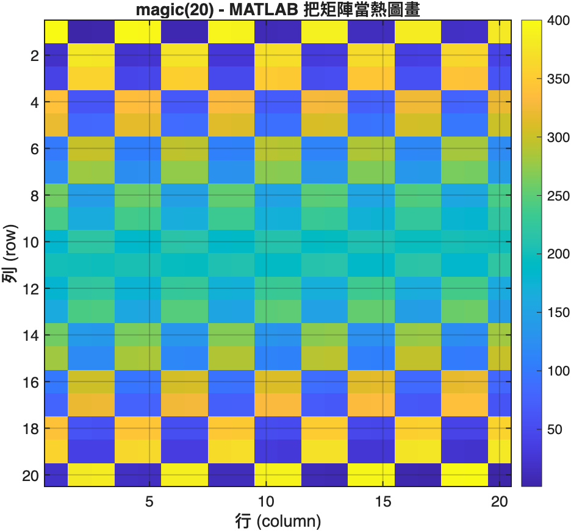
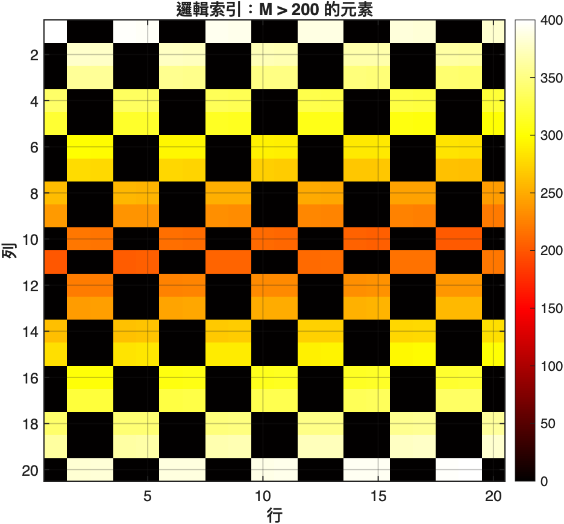
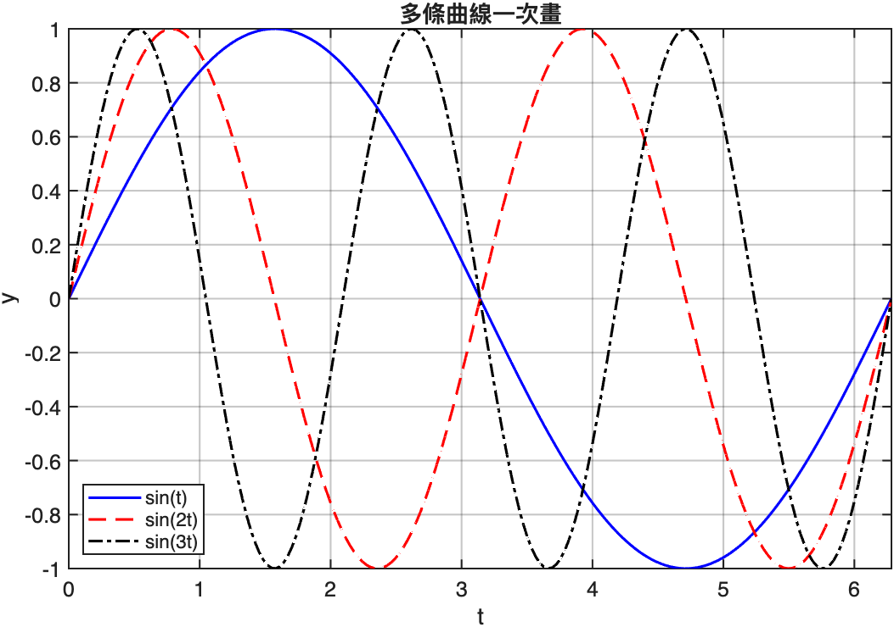
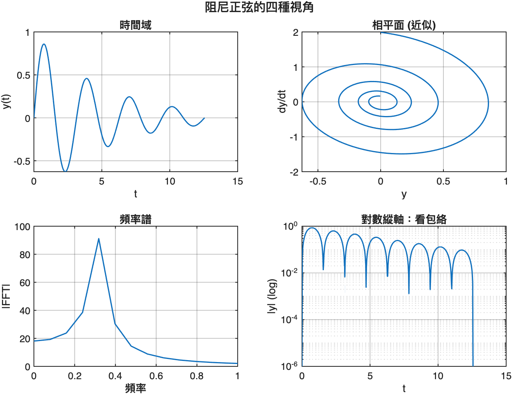
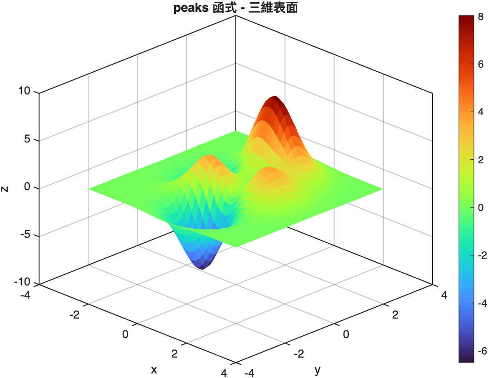
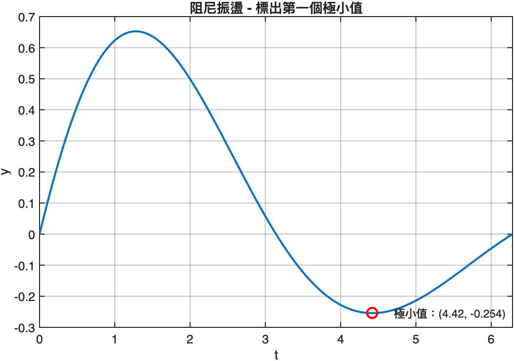
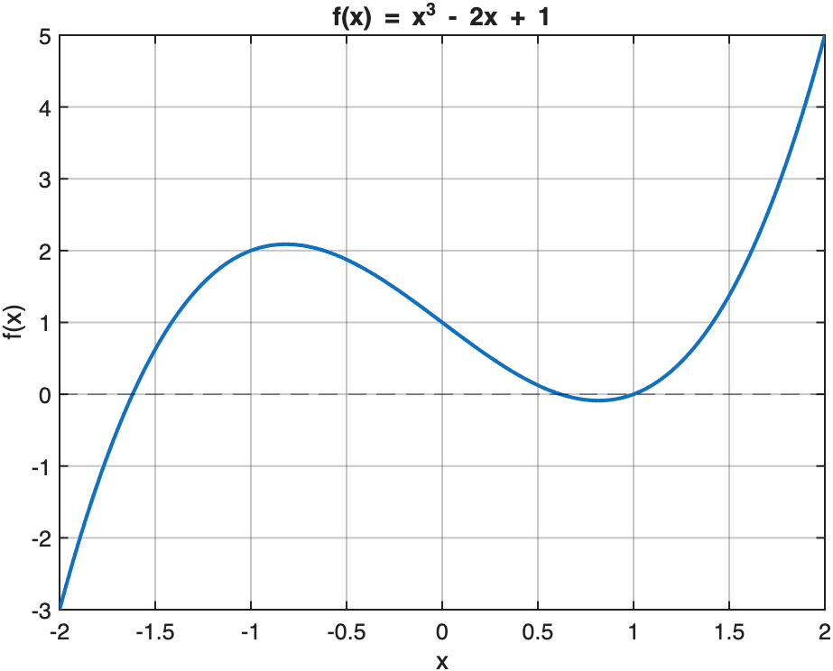
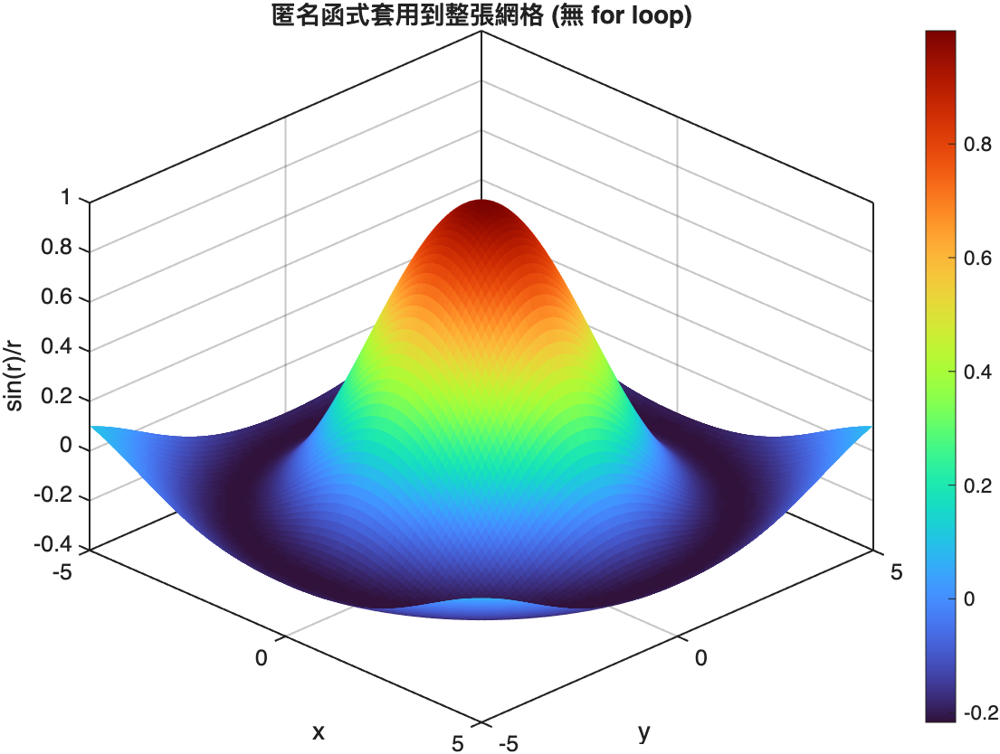
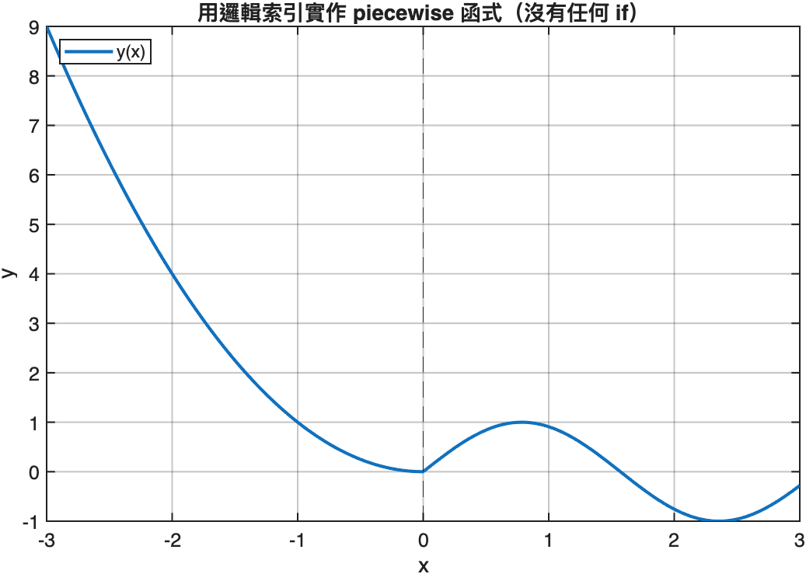
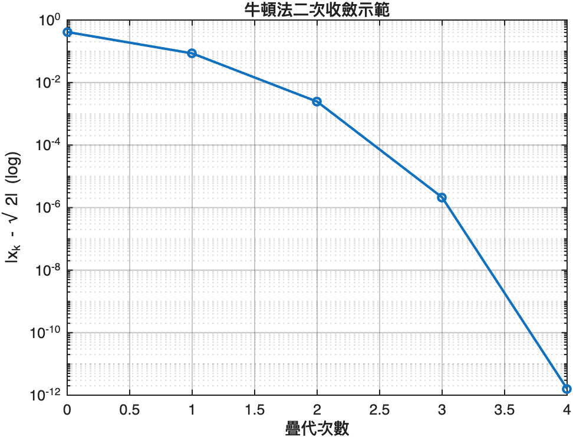

# 01. MATLAB 語法基礎

寫給已經會其他語言（Python、C、Java…）、但第一次認真用 MATLAB 的人。
重點在「**向量化思維**」與「**矩陣是一等公民**」，剩下的語法很快就會。

對應腳本（在 `scripts/` 目錄）：

| # | 腳本 | 主題 |
|---|------|------|
| 01 | [`01_vectors_matrices.m`](scripts/01_vectors_matrices.m) | 建立向量/矩陣、索引、矩陣 vs 逐元素運算、廣播 |
| 02 | [`02_plotting.m`](scripts/02_plotting.m) | 多曲線、subplot、3D 表面、註解 |
| 03 | [`03_functions.m`](scripts/03_functions.m) | 匿名函式、function handle、外部 .m 函式 |
| 04 | [`04_control_flow.m`](scripts/04_control_flow.m) | if/for/while、向量化技巧、邏輯索引 |

---

## 1. 向量與矩陣：MATLAB 的母語

最常用的運算子是 **colon (`:`)**：

```matlab
v1 = 0:0.1:2*pi;            % start : step : stop
v2 = linspace(0, 2*pi, 100); % 在 [0, 2π] 平均放 100 個點
```

`length(v1)` 是 63 而不是 62，因為 colon 含尾端、且 `0.1 * 62 = 6.2 < 2π`，會多收一筆。

### 索引從 1 開始

對寫慣 Python/C 的人這是最大絆腳石：

```matlab
A = magic(4);   % 4x4 魔方陣
A(1, 1)         % 第一列第一行，不是 A(0,0)
A(end, end)     % end 代表「最後一個」
A(:, 2)         % 整個第 2 行
A(2:3, [1 4])   % 第 2~3 列、第 1 與第 4 行
```

`:` 在索引位置代表「整個維度」。`end` 是內建關鍵字，在索引中代表該維度的最後位置。

### 矩陣運算 vs 逐元素運算

這是 MATLAB 跟 Python/NumPy 最大的觀念落差：

```matlab
B = [1 2; 3 4];
C = [5 6; 7 8];

B * C    % 矩陣乘法
B .* C   % 逐元素相乘（注意有點）

B^2      % B*B
B.^2     % 每個元素平方
```

**口訣**：要逐元素就加點 `.`，沒加點就是矩陣級。

### 廣播（implicit expansion）

R2016b 之後 MATLAB 也支援 NumPy 風格的廣播：

```matlab
row = [1 2 3];      % 1x3
col = [10; 20; 30]; % 3x1
row + col           % 自動展開成 3x3
```

### 視覺化矩陣

把矩陣當熱圖看：



邏輯索引 `M > 200` 回傳布林矩陣，可以直接用來篩選：



```matlab
M = magic(20);
mask = M > 200;        % 布林矩陣
M(mask)                % 取出符合條件的元素（拉平成向量）
nnz(mask)              % 算有幾個 true（200 個）
```

---

## 2. 繪圖：MATLAB 的強項

一個 `plot` 就能畫多曲線，給不同 linespec 字串即可：

```matlab
plot(t, sin(t), 'b-', ...
     t, sin(2*t), 'r--', ...
     t, sin(3*t), 'k-.');
legend({'sin(t)','sin(2t)','sin(3t)'});
```



### subplot 把多視圖塞同一張

工程上看一個訊號通常會同時看：時間域、相平面、頻率譜、包絡。
`subplot(rows, cols, idx)` 把 figure 切格：



### 3D 表面

`meshgrid` + `surf` 是工程界最常見的 3D 視覺化：

```matlab
[X, Y] = meshgrid(-3:0.15:3, -3:0.15:3);
Z = peaks(X, Y);
surf(X, Y, Z, 'EdgeColor', 'none');
```



`meshgrid` 把兩個一維向量「組合」成兩個二維網格，後面所有的逐元素運算就是「在每個 (x, y) 位置算一次」。這是 MATLAB 向量化處理多變數函式的標準做法。

### 標註

```matlab
[ymin, idx] = min(y);    % 找極小值
plot(t(idx), ymin, 'ro', 'MarkerSize', 10);
text(t(idx)+0.2, ymin, sprintf('(%.2f, %.3f)', t(idx), ymin));
```



---

## 3. 函式三種寫法

### 匿名函式（最常用）

```matlab
f = @(x) x.^3 - 2*x + 1;
f(2)              % 算單點
f([1 2 3])        % 也可餵向量
```



### 函式當參數傳

很多 MATLAB 內建函式吃 function handle：

```matlab
root = fzero(f, 1);   % 在 x=1 附近找 f(x)=0
                       % 回傳 1.000000
```

控制章節用到的 `ode45`、`fsolve`、`fminunc` 全都吃 function handle。

### 外部 .m 函式檔

慣例：**一個 .m 檔一個 function，檔名 = 函式名**。

```matlab
% my_max.m
function [m, idx] = my_max(v)
    m = v(1);
    idx = 1;
    for k = 2:length(v)
        if v(k) > m
            m = v(k);
            idx = k;
        end
    end
end
```

呼叫端：

```matlab
[m, idx] = my_max([3 1 4 1 5 9 2 6]);
% m = 9, idx = 6
```

注意 `[m, idx] = foo()` 這個雙回傳值語法是 MATLAB 特色。如果只要第一個，可以 `m = my_max(v)`。

### 向量化：對整張網格套用

```matlab
g = @(x) sin(x) ./ (x + 1e-9);
R = sqrt(X.^2 + Y.^2);
Z = g(R);    % 一次算完整張網格
```



**為什麼要向量化**：MATLAB 的迴圈以前很慢（雖然 R2015b JIT 後改善很多），但更重要是 **可讀性**。一行 `Z = g(R)` 比雙重 for loop 直觀得多。

---

## 4. 控制流與向量化技巧

### for / while / if 跟其他語言差不多

```matlab
for k = 1:10
    disp(k);
end

while abs(x^2 - 2) > 1e-10
    x = x - (x^2 - 2) / (2*x);   % 牛頓法
end

if x > 0
    sgn = 1;
elseif x < 0
    sgn = -1;
else
    sgn = 0;
end
```

注意都要 `end` 結尾，沒有大括號或縮排語法。

### 用邏輯索引取代 if

想實作分段函式：

```matlab
% 「if x<0 用 x^2，否則用 sin(2x)」
% 寫法 1：for + if（慢、不 MATLAB）
y = zeros(size(x));
for k = 1:length(x)
    if x(k) < 0
        y(k) = x(k)^2;
    else
        y(k) = sin(2*x(k));
    end
end

% 寫法 2：邏輯索引（快、慣用）
y = zeros(size(x));
y(x < 0)  = x(x < 0).^2;
y(x >= 0) = sin(2*x(x >= 0));
```



### for vs 向量化的時間差

```matlab
N = 1000;
% for loop
y = zeros(1, N);
for k = 1:N
    y(k) = sin(k/100) * exp(-k/500);
end

% 向量化
k = 1:N;
y = sin(k/100) .* exp(-k/500);
```

在現代 MATLAB（R2025a）這兩者速度差距已經不大（JIT 把 loop 編譯掉了），但向量化在**大型陣列**仍明顯快，而且程式短得多。

### 牛頓法收斂示範

```matlab
x = 1.0; tol = 1e-10;
while abs(x^2 - 2) > tol
    x = x - (x^2 - 2) / (2*x);
end
```

牛頓法是二次收斂：每疊代一次，誤差的數量級平方下降。



對數縱軸下幾乎是垂直線，這就是「二次收斂」的視覺化。

---

## 下一章

[02. 數學與物理觀念](../02-math-physics/README.md) — 我們要把 MATLAB 拿來解工程問題前，先把符號運算、ODE、線性代數的基礎工具裝起來。
