# 02. 數學與物理基本觀念

把控制系統章節要用的數學工具打底：符號運算、ODE 數值解、線性代數、複數頻域。

| # | 腳本 | 主題 |
|---|------|------|
| 01 | [`01_symbolic.m`](scripts/01_symbolic.m) | 符號運算（微分/積分/解 ODE/泰勒） |
| 02 | [`02_ode_basics.m`](scripts/02_ode_basics.m) | `ode45`/`ode15s` 數值解、狀態向量、事件偵測 |
| 03 | [`03_linear_algebra.m`](scripts/03_linear_algebra.m) | 線性系統、特徵值、SVD、條件數 |
| 04 | [`04_complex_freq.m`](scripts/04_complex_freq.m) | 複數、Euler 公式、FFT、Laplace 直觀 |

---

## 1. 符號運算：把手算的部分交給 MATLAB

工程上常要對方程式做推導。MATLAB 的 Symbolic Math Toolbox 可以幫你做：

```matlab
syms x          % 宣告符號變數
f = sin(x)^2 + exp(-x);
diff(f, x)      % => 2*cos(x)*sin(x) - exp(-x)
int(f, x)       % 不定積分
int(f, x, 0, inf)  % 定積分
```

### 自動解 ODE

彈簧質量阻尼系統 `m·x'' + c·x' + k·x = 0` 的解析解：

```matlab
syms x(t)
eqn = diff(x, t, 2) + 0.5*diff(x, t) + 4*x == 0;
Dx = diff(x, t);
cond = [x(0) == 1, subs(Dx, t, 0) == 0];
sol = dsolve(eqn, cond);   % 自動解出 e^(-t/4) 形式
```

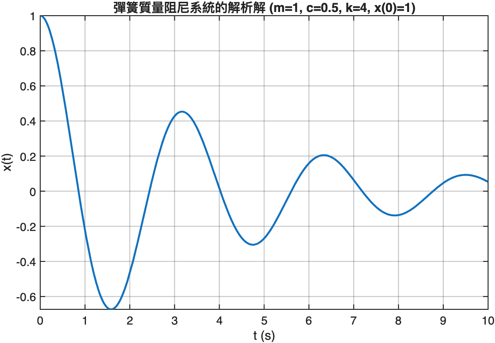

### 泰勒展開：理解非線性近似

控制理論中「在工作點 linearize」就是泰勒展開到一階：

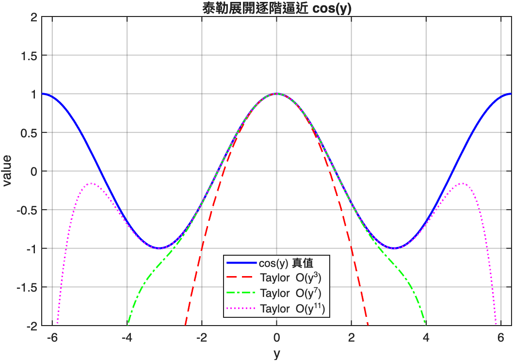

階數越高，逼近範圍越廣，但永遠在距離原點越遠處發散。這也說明為什麼線性化控制器在「大訊號」下會崩潰。

### 何時用符號運算

- 推導控制器增益的解析表達式
- 把複雜的微分一次算清楚
- 把結果轉成 LaTeX：`latex(sol)`

**不要**對大型矩陣或非線性 ODE 死硬用符號運算 — 會慢到吐血或根本解不出來。那是 `ode45` 的工作。

---

## 2. ODE 數值解：工程主力 `ode45`

### 最簡單的例子：一階衰變

```matlab
% dy/dt = -k*y，例如放射性衰變
k = 0.5;
f = @(t, y) -k * y;
[t, y] = ode45(f, [0, 10], 1.0);
```

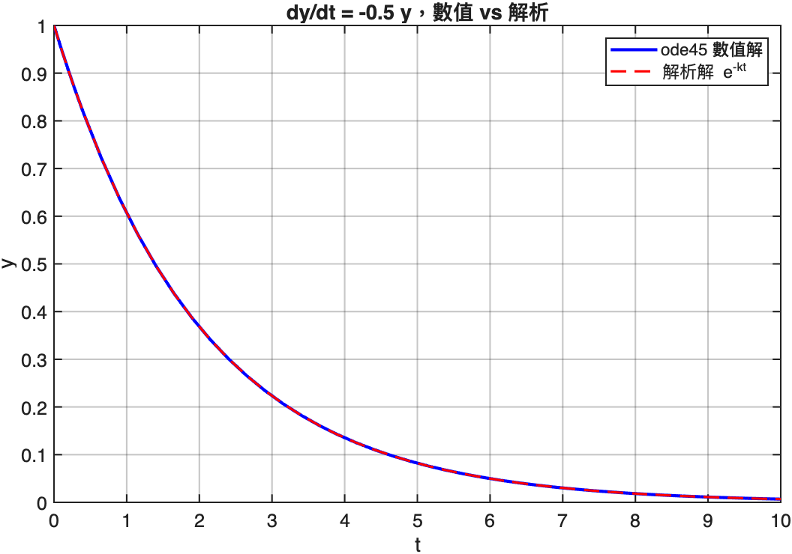

數值解（藍）與解析解 `y = e^(-kt)`（紅虛線）重疊 — 這是檢驗 ode45 設定是否正確的最簡單 sanity check。

### 黃金規則：高階 ODE 改寫成一階狀態向量

`m·x'' + c·x' + k·x = 0` 不能直接餵 `ode45`，要改寫成：

```
令 y1 = x, y2 = x'
則 y1' = y2
   y2' = -(c/m)*y2 - (k/m)*y1
```

對應 MATLAB：

```matlab
f = @(t, y) [y(2);
             -(c/m)*y(2) - (k/m)*y(1)];

[t, Y] = ode45(f, [0 20], [1; 0]);  % 初始 x=1, x'=0
% Y(:,1) = x(t),  Y(:,2) = x'(t)
```

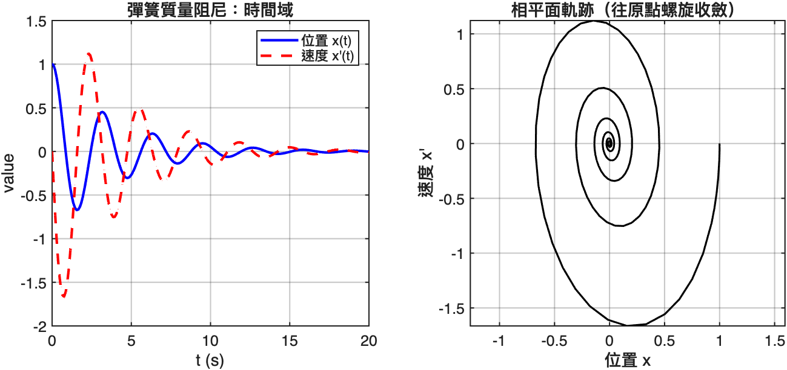

相平面圖（右）會「往原點螺旋收斂」— 這就是「阻尼振盪」的幾何意義。

### 求解器選擇

| 求解器 | 用途 |
|--------|------|
| `ode45` | 預設首選，4-5 階 Runge-Kutta |
| `ode15s` | 剛性 (stiff) 問題，例如 van der Pol 大 μ |
| `ode89` | 高精度需求 |
| `ode23t` | 中度剛性、需要保守變步 |

van der Pol oscillator `x'' - μ(1-x²)x' + x = 0` 在 μ 大時是剛性問題，ode45 會慢到崩潰，ode15s 一下就解完：

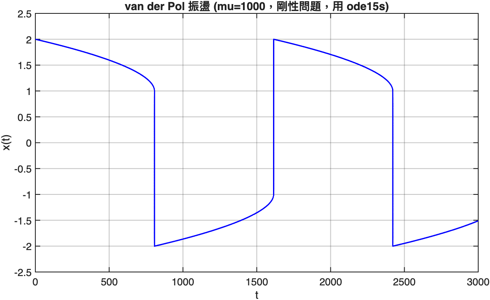

### 事件偵測：拋體何時落地

`ode45` 可以在「某個量歸零」時自動停止積分。落地問題：

```matlab
% hitGround.m
function [value, isterminal, direction] = hitGround(~, s)
    value = s(2);        % 監看 y
    isterminal = 1;      % 觸發即停
    direction = -1;      % 只在「下降」時觸發
end

opts = odeset('Events', @hitGround);
[t, S, te, se] = ode45(projectile, [0, 10], s0, opts);
% te = 落地時間,  se = 落地時的狀態
```

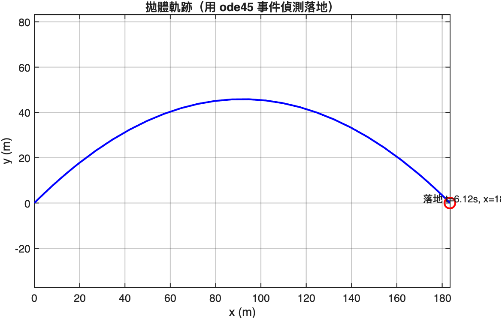

---

## 3. 線性代數：控制理論的根基

### 解線性系統：用 `\` 不要用 `inv`

```matlab
% 解 Ax = b
x = A \ b;              % 對的
x = inv(A) * b;         % 錯的（數值差、慢）
```

`A\b` 內部用 QR 或 LU 分解，數值穩定且通常更快。

### 特徵值：穩定性分析的命脈

對狀態方程 `x' = A·x`，A 的特徵值決定一切：

| 特徵值 | 系統行為 |
|--------|---------|
| 實部全為負 | 漸近穩定（會收斂到原點） |
| 有實部為正 | 不穩定（會發散） |
| 有虛部非零 | 振盪 |
| 純虛數 | 持續等幅振盪（邊界穩定） |

```matlab
A = [0 1; -4 -0.5];
eig(A)
% => -0.25 ± 1.984i  -> 阻尼振盪
```

### 特徵向量的幾何意義

對對稱矩陣 `M = [2 1; 1 3]`，把單位圓餵進去看會被壓成什麼形狀：

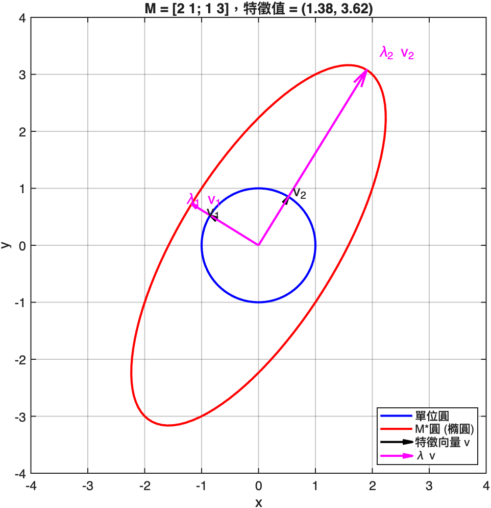

藍圈是原本的單位圓，紅橢圓是被 M 線性變換後的形狀。**特徵向量就是「不被旋轉只被縮放」的特殊方向**，縮放倍率就是對應的特徵值。

控制中常用這個觀念來「找出系統的主要振動模態」。

### SVD：萬用的矩陣分解

```matlab
[U, S, V] = svd(A);
% A = U * S * V'
```

`magic(8)` 看起來是普通 8x8 矩陣，但 SVD 暴露它其實只有 3 個非零奇異值 — 也就是「秩 = 3」：

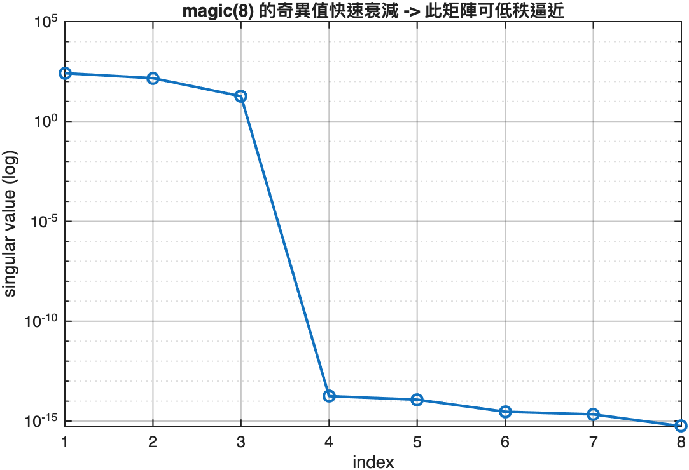

控制上 SVD 用於：
- 最小平方擬合（多餘變量時）
- 系統識別（Hankel 矩陣降秩）
- 可控/可觀測性矩陣的秩判定

### 條件數：別亂解病態系統

`cond(A)` 量化「A 有多接近奇異」。Hilbert 矩陣是經典病態例：

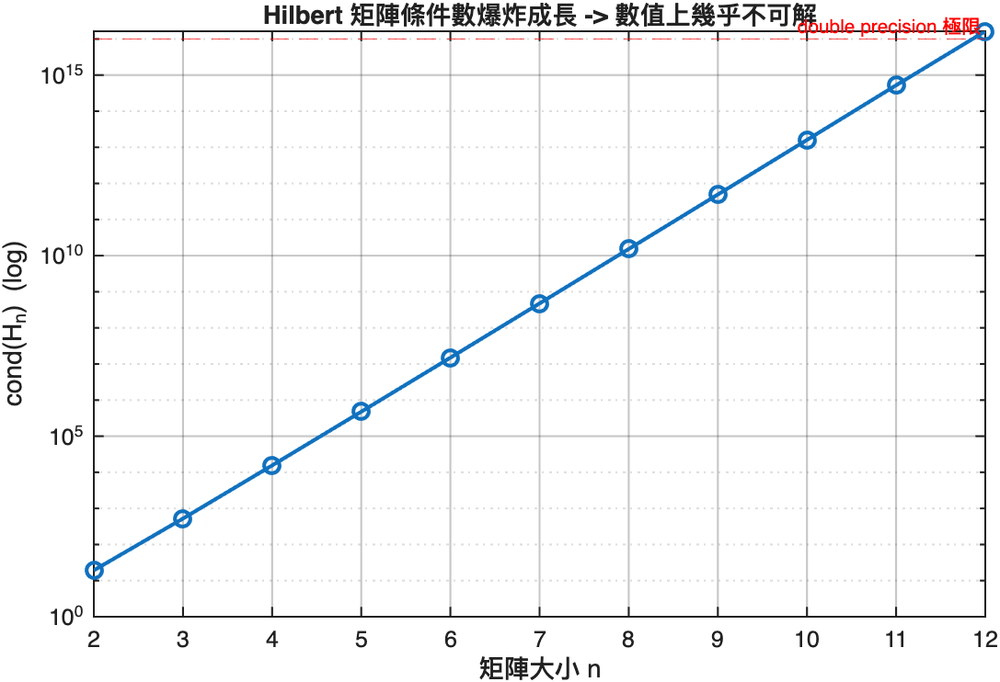

12x12 的 Hilbert 矩陣條件數已經達 10¹⁶ — 雙精度數值極限。意味著 `b` 的最後一位誤差會被放大到整個解都不可信。

---

## 4. 複數與頻域：通往控制 Bode 圖的橋

### Euler 公式：複指數就是旋轉

```
e^(jθ) = cos(θ) + j·sin(θ)
```

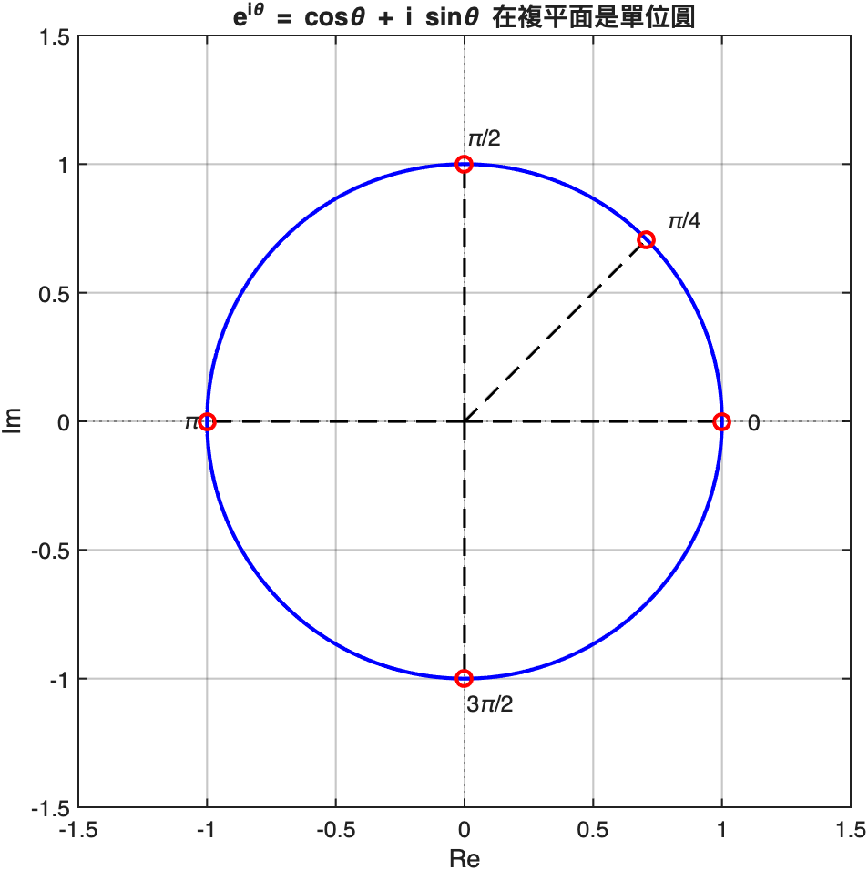

時間訊號 `e^(jωt)` 在複平面就是「以角速度 ω 旋轉的單位向量」。所有正弦訊號都可以看成兩個反向旋轉複指數的合成。

### FFT：把訊號拆成頻率

```matlab
fs = 1000;
t = (0:1/fs:1-1/fs)';
sig = 0.7*sin(2*pi*50*t) + sin(2*pi*120*t) + 0.5*randn(size(t));

Y = fft(sig);
% 取單邊頻譜
L = length(sig);
P1 = abs(Y(1:L/2+1))/L * 2;
f = fs*(0:L/2)/L;
```

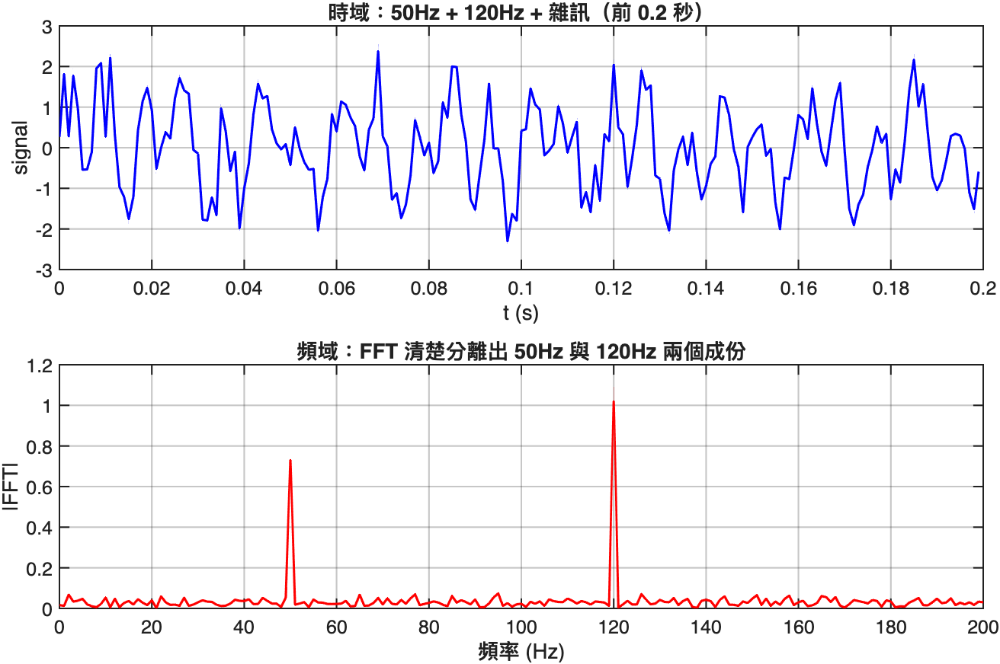

時域看不出來的 50Hz 和 120Hz 兩成份，FFT 一眼分離出來。

### Laplace s 平面：傳遞函數的家

下一章控制會大量出現 `H(s) = 1/(s² + 0.5s + 4)`。在複平面 `s = σ + jω` 看 `|H(s)|`：

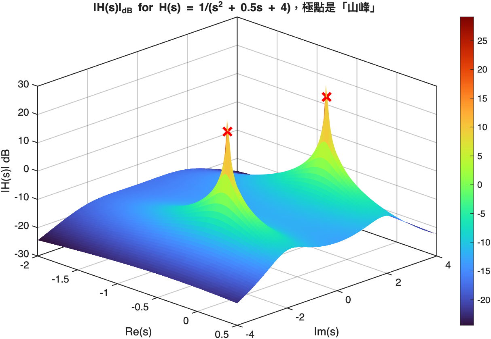

兩個「山峰」位置正是 `s² + 0.5s + 4 = 0` 的根 — 這就是**極點**。控制工程的「極點/零點分析」全部建立在這張圖上。

### Bode magnitude = j·ω 軸切片

把 `s = j·ω` 限制在虛軸，畫 `|H(jω)|` 的對數圖：

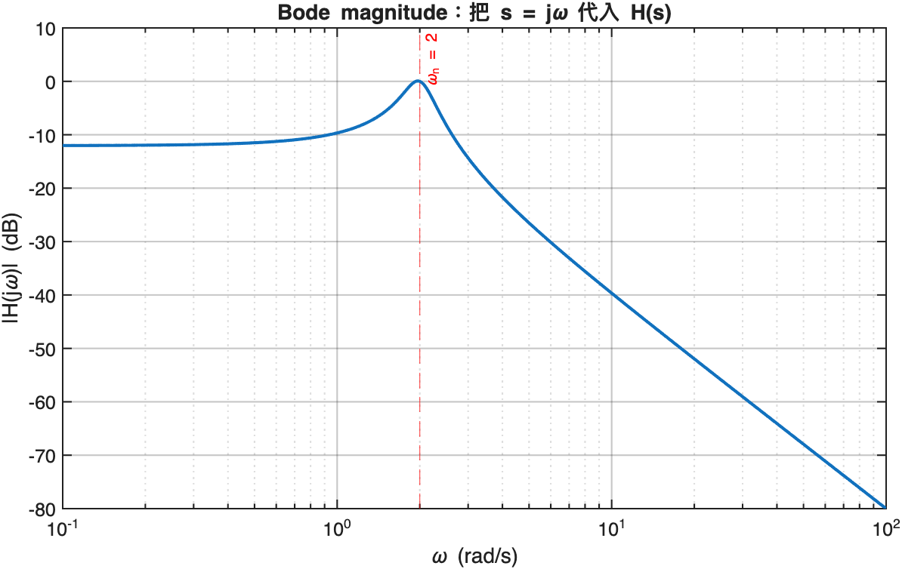

這就是 Bode 圖的本質：**從 s 平面切一刀，看頻率響應**。

---

## 下一章

[03. 物理模型模擬](../03-physics-simulation/README.md) — 開始把這些工具用在具體物理問題上。
