# 03. 物理模型模擬

把第 2 章的工具實際用到物理問題上。每個例題都是「**寫下微分方程 → 改寫成狀態空間 → 餵 ode45 → 畫圖**」這條標準流程。

| # | 腳本 | 物理 | 數學 |
|---|------|------|------|
| 01 | [`01_projectile_drag.m`](scripts/01_projectile_drag.m) | 拋體運動（含空氣阻力） | 4 維 ODE + 事件偵測 |
| 02 | [`02_spring_mass_damper.m`](scripts/02_spring_mass_damper.m) | 彈簧質量阻尼 | 2 階 ODE、共振、相平面 |
| 03 | [`03_double_pendulum.m`](scripts/03_double_pendulum.m) | 雙擺（混沌） | Lagrangian 力學、能量守恆 |
| 04 | [`04_rlc_circuit.m`](scripts/04_rlc_circuit.m) | RLC 電路 | 機械-電氣類比、Bode 入門 |
| 05 | [`05_heat_diffusion.m`](scripts/05_heat_diffusion.m) | 1D 熱傳導 | PDE、pdepe |

---

## 1. 拋體運動（含空氣阻力）

### 數學模型

無阻力：
```
x'' = 0
y'' = -g
```

含阻力（拖曳力與速度平方成正比，方向相反）：
```
v = sqrt(vx^2 + vy^2)
x'' = -b * v * vx
y'' = -g - b * v * vy
```
其中 `b = ½·ρ·Cd·A / m`。

### 狀態向量改寫

`s = [x; y; vx; vy]`，餵 ode45。落地時用事件偵測停止：

```matlab
dyn_air = @(t, s) [s(3);
                   s(4);
                   -b * sqrt(s(3)^2 + s(4)^2) * s(3);
                   -g - b * sqrt(s(3)^2 + s(4)^2) * s(4)];
opts = odeset('Events', @hitGround3);
[t, S] = ode45(dyn_air, [0, 20], s0, opts);
```

### 結果：阻力把射程砍掉一半以上

棒球以 50 m/s、45° 發射：

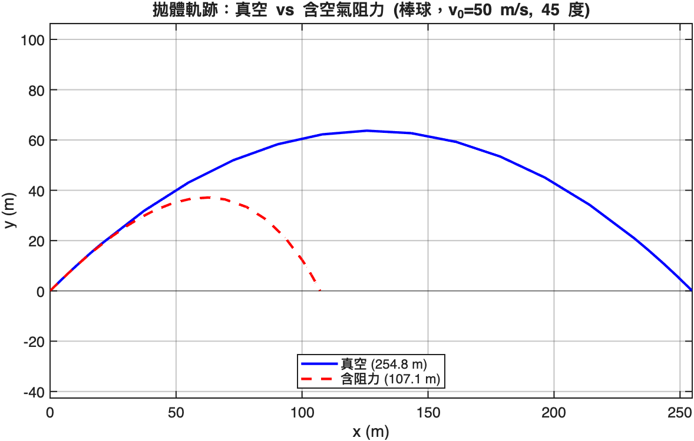

| | 真空 | 含空氣阻力 |
|---|---|---|
| 射程 | 254.8 m | 107.1 m |
| 飛行時間 | 7.21 s | 5.46 s |

### 最佳發射角不再是 45°

真空理論 45° 最大射程是高中物理常識，但加上阻力之後最佳角度往下降：

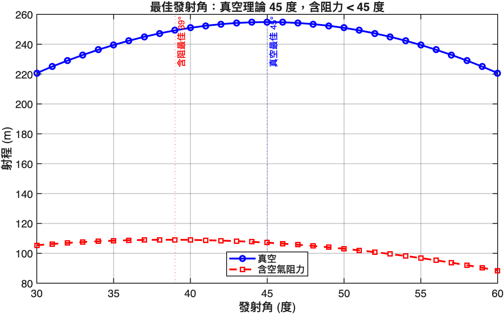

含阻力時最佳約 38°。這就是為什麼鉛球比賽選手不會用 45° 出手。

---

## 2. 彈簧-質量-阻尼

### 標準二階系統

```
m·x'' + c·x' + k·x = F(t)
```

引入兩個無因次量：
- 自然頻率 `ω_n = sqrt(k/m)`
- 阻尼比 `ζ = c / (2·sqrt(m·k))`

### 三種響應行為

固定 `m=1, k=4` (ω_n = 2)，改變 ζ：

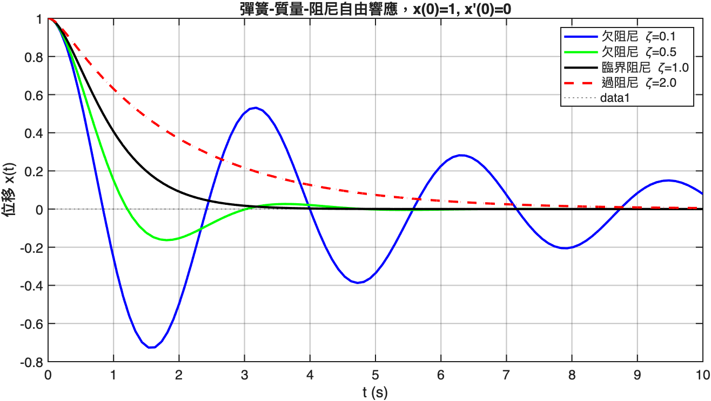

| ζ | 名稱 | 行為 |
|---|------|------|
| < 1 | 欠阻尼 | 振盪後收斂 |
| = 1 | 臨界阻尼 | **最快收斂無振盪** |
| > 1 | 過阻尼 | 慢慢爬回 |

「臨界阻尼最快」是控制設計重要直覺：要快、要穩、不振盪，找 ζ ≈ 1。實務上常設 ζ ≈ 0.7（一點點 overshoot 換取較快上升時間）。

### 受迫振盪 → 共振曲線

外加 `F(t) = F₀·sin(ω·t)`，掃 ω 看穩態振幅：

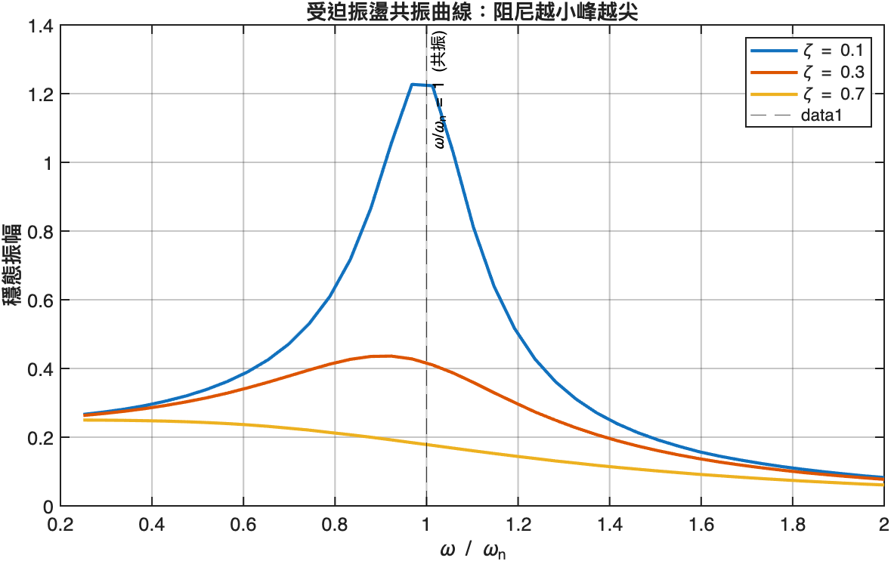

當驅動頻率 ω 接近 ω_n 時振幅放大。阻尼越小峰越尖、放大倍率越高 — 這就是橋樑、樂器、機械共振的數學形式。

### 相平面：流場視角

把所有起始 `(x₀, v₀)` 的軌跡疊在一起，看流場結構：

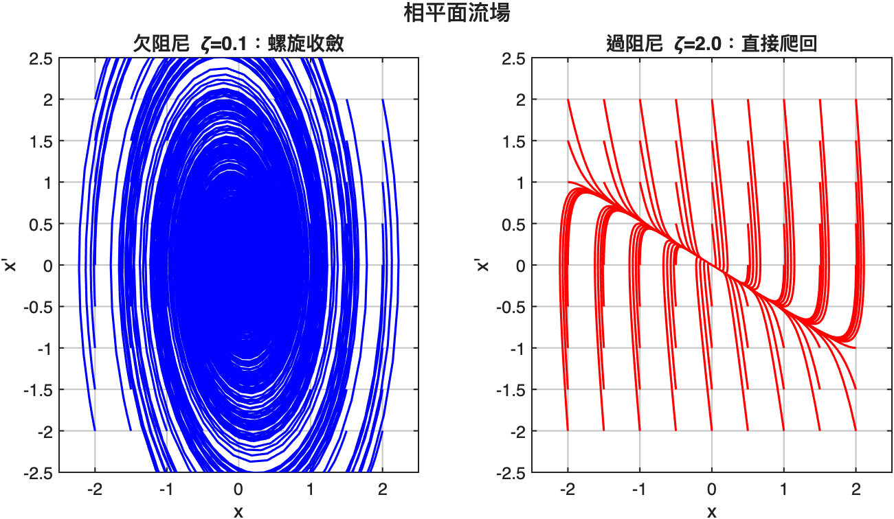

- **欠阻尼**：每條軌跡都是螺旋線向原點收斂 — 原點是穩定螺旋焦點
- **過阻尼**：軌跡沿著兩個特徵向量方向爬回 — 原點是穩定節點

特徵值的虛部消失 = 軌跡不再轉。這也是為什麼第 2 章要先談特徵值。

---

## 3. 雙擺：簡單規則，混沌行為

兩根長度 L 質量 m 的剛桿相接（無摩擦）。乍看簡單，實則是非線性 ODE 教科書級例題：對初始角度極微小的擾動就會在 ~10 秒內完全發散。

完整方程式參見 [`double_pendulum_rhs.m`](scripts/double_pendulum_rhs.m)（從 Lagrangian 推出）。

### 對初始條件敏感

兩個雙擺初始角度只差 `10^-3 rad`（看不到的差異），跑 30 秒後：

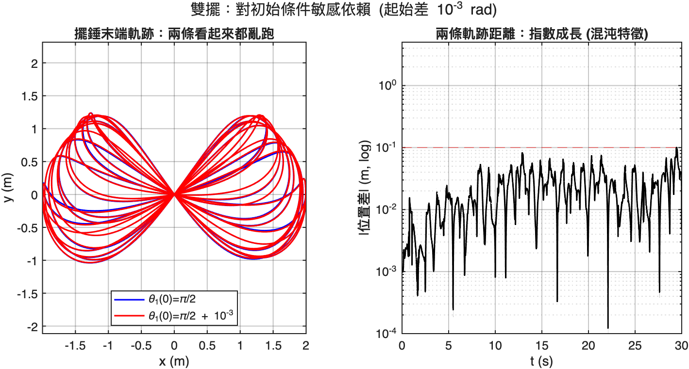

左圖：兩條軌跡（藍/紅）完全分道揚鑣
右圖：兩擺末端位置的差距以**指數成長**（半對數圖近似直線就是指數）

這就是「**混沌系統**」的定義 — 有界但對初始條件敏感。

### 能量守恆：解 ODE 品質檢驗

無摩擦系統能量應為常數。用 `RelTol = 1e-9` 解出來的能量：

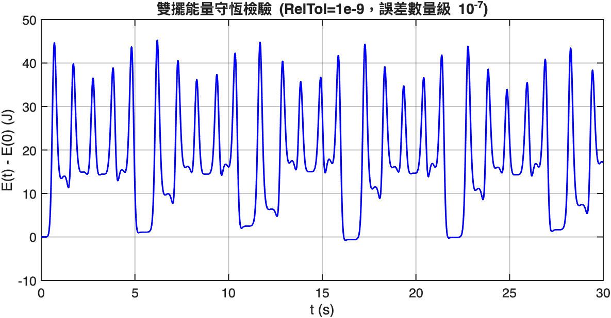

漂移在 10^-7 量級，相對誤差 ~10^-8 — 是 ode45 的可信度上限。如果你的物理模擬不收斂或結果可疑，**先把容差調緊、再看能量是否守恆**，是除錯第一步。

---

## 4. RLC 電路：電的「彈簧質量阻尼」

### Kirchhoff 推導

對 L-R-C 串聯，繞迴路一週：

```
V_L + V_R + V_C = V_in
L·di/dt + R·i + Q/C = V_in
```

代 `i = dQ/dt`：

```
L·Q'' + R·Q' + Q/C = V_in
```

跟彈簧質量阻尼**結構一模一樣**：

| 機械 | 電路 |
|------|------|
| 質量 m | 電感 L |
| 阻尼 c | 電阻 R |
| 彈簧 k | 1/電容 = 1/C |
| 外力 F | 輸入電壓 V_in |

學會其中一個，另一個就免費送了。

### 階躍響應

`L=0.1H, R=5Ω, C=100μF` → ω_n ≈ 50 Hz, ζ ≈ 0.08（很欠阻尼）：

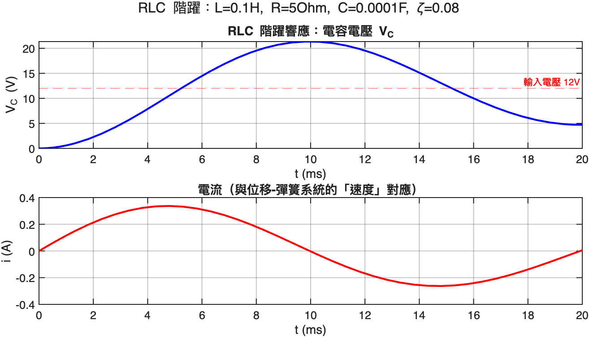

電容電壓 V_C 圍著 12V 振盪後穩定 — 跟彈簧位移振盪到平衡點完全一樣。

### 頻率響應 = Bode 入門

掃外加電壓頻率，看 V_C 的穩態振幅：

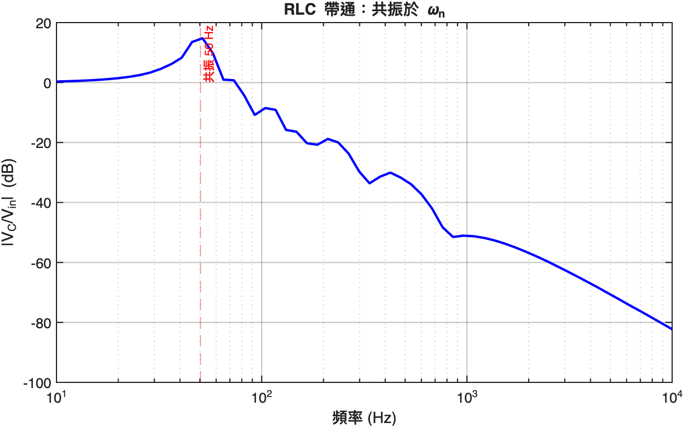

50 Hz 附近共振峰非常陡 — 因為 ζ 很小。這就是為什麼 RLC 可以當「**選頻濾波器**」用。

### 用 Control System Toolbox 一行畫 Bode

```matlab
% V_C(s)/V_in(s) = 1 / (LC*s^2 + RC*s + 1)
sys = tf(1, [L*C, R*C, 1]);
bode(sys);
```

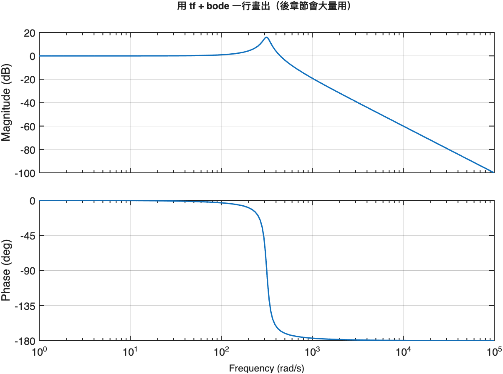

下一章控制會大量用 `tf`、`bode`、`step`、`rlocus`。

---

## 5. 1D 熱傳導：踏入 PDE

ODE 是「函數對時間的微分」。PDE 進一步包含「對空間的微分」。1D 熱傳導：

```
∂u/∂t = α · ∂²u/∂x²
```

`u(x, t)` 是時間 t 在位置 x 的溫度。

### `pdepe` 是 MATLAB 的 1D PDE 主力

要提供三個 callback：PDE 形式、初始條件、邊界條件。

```matlab
sol = pdepe(0, ...
    @(x, t, u, dudx) deal(1, alpha*dudx, 0), ...        % PDE
    @(x) 100 * (x > 0.4*L & x < 0.6*L), ...             % IC：中段 100°C
    @(xl, ul, xr, ur, t) deal(ul, 0, ur, 0), ...        % BC：兩端 0°C
    x, t);
```

### 結果：擴散往兩端與穩態

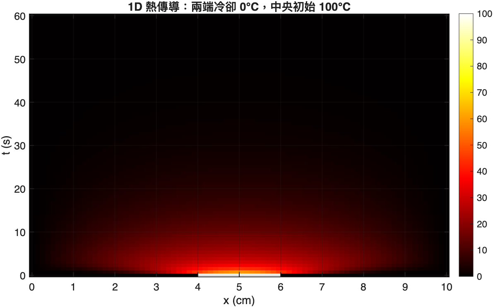

熱在 ~30 秒內擴散開來，最終全部冷卻到 0°C（兩端被「冷源」固定）。

### 不同時刻的快照

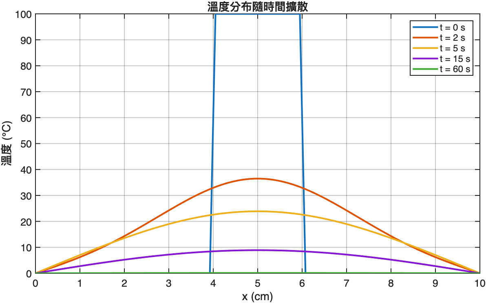

最高點隨時間下降，分佈從「方波」演化成「鐘形」 — 這是擴散方程的特徵解（Gaussian-like）。

### 中央點對數衰減

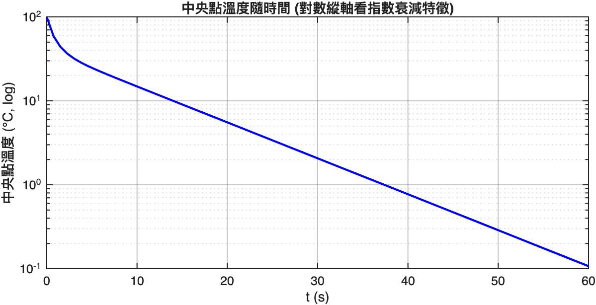

對數圖上接近直線 → 衰減大致是指數型。可用分離變數法解析推導，數值結果與理論吻合。

---

## 共通的思考流程

把這 5 個例題整理出來的「物理模擬 SOP」：

1. **寫下微分方程**（牛頓定律、Kirchhoff、傅立葉定律）
2. **改寫成一階狀態向量**（高階 → 多個一階）
3. **挑求解器**（ODE 用 ode45/ode15s，PDE 用 pdepe）
4. **設邊界/初始條件**
5. **設容差**（RelTol 通常 1e-6 ~ 1e-9）
6. **檢驗守恆量**（能量、質量、動量）作為信心度
7. **掃參數**看系統如何隨參數變化（共振曲線、最佳角度）

下一章開始**控制**：不只觀察系統，而是主動讓系統做我們想要的事。

---

## 下一章

[04. 自動控制](../04-control-systems/README.md) — 從傳遞函數到 LQR，把模型變成可設計的控制系統。
