# 04. 自動控制

本章把第 2、3 章的工具串成一條完整的控制設計流程：

```
建立模型 (tf/ss) -> 分析性能 (step/bode/rlocus) -> 設計控制器 (pid/place/lqr) -> 驗證
```

| # | 腳本 | 主題 |
|---|------|------|
| 01 | [`01_transfer_function.m`](scripts/01_transfer_function.m) | 傳遞函數 tf、零極點圖、DC 馬達模型 |
| 02 | [`02_step_response.m`](scripts/02_step_response.m) | 時域規格：上升時間、過衝、settling |
| 03 | [`03_bode_nyquist.m`](scripts/03_bode_nyquist.m) | 頻域分析、穩定餘裕 |
| 04 | [`04_root_locus.m`](scripts/04_root_locus.m) | 根軌跡、臨界增益 |
| 05 | [`05_pid_design.m`](scripts/05_pid_design.m) | P / PI / PID、pidtune、干擾抑制 |
| 06 | [`06_state_space.m`](scripts/06_state_space.m) | 狀態空間、可控/可觀測、極點配置 |
| 07 | [`07_lqr_inverted_pendulum.m`](scripts/07_lqr_inverted_pendulum.m) | LQR + 倒立擺 |

---

## 1. 傳遞函數：頻域表示法

從第 3 章的 RLC 我們已經看過：對線性 ODE 取 Laplace 變換，輸出/輸入比就是傳遞函數。

```matlab
% DC 馬達 (忽略電感):
% G(s) = omega(s)/V(s) = (Kt/R) / (J*s + B + Kt*Kb/R)
G = tf(Kt/R, [J, B + Kt*Kb/R]);
```

### tf-step 與 ode45 結果一致

`step(G)` 是 MATLAB 算階躍響應的一行法，比手寫 ode45 簡潔：

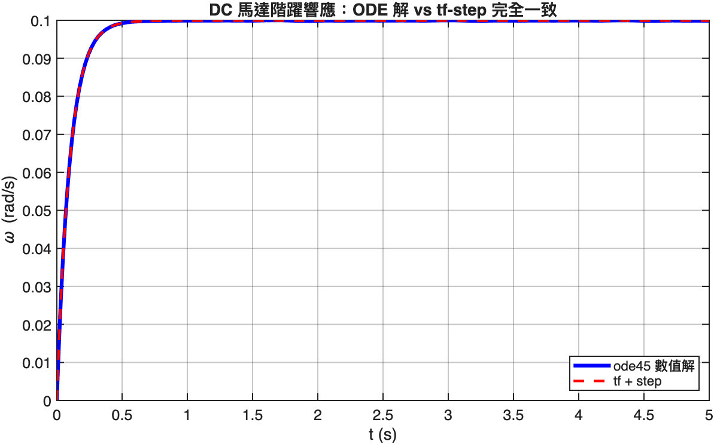

兩條線完全重疊，證明：**對線性系統，傳遞函數和 ODE 是等價的兩種表示**。但 `tf` 後續能直接套 `step`、`bode`、`rlocus`、`feedback`、`pidtune`，是控制工程的標準入口。

### 不同階次的響應特徵

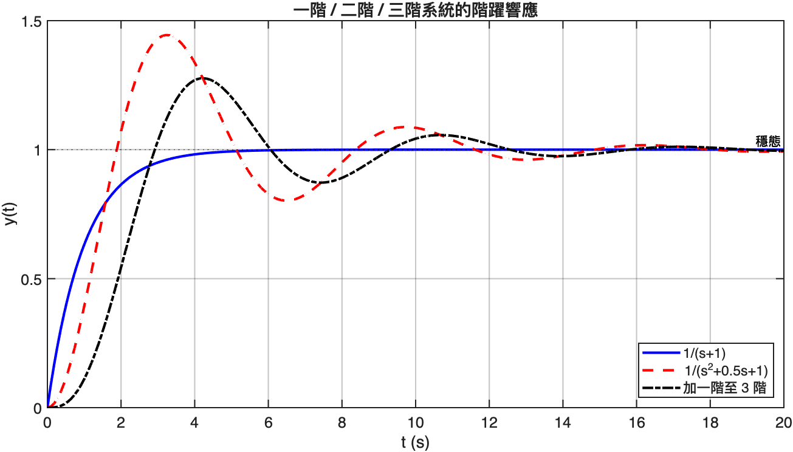

- 1 階：單調上升、無過衝
- 2 階欠阻尼：振盪後收斂
- 3 階：相位滯後更多、上升更慢

### 極點位置 = 穩定性

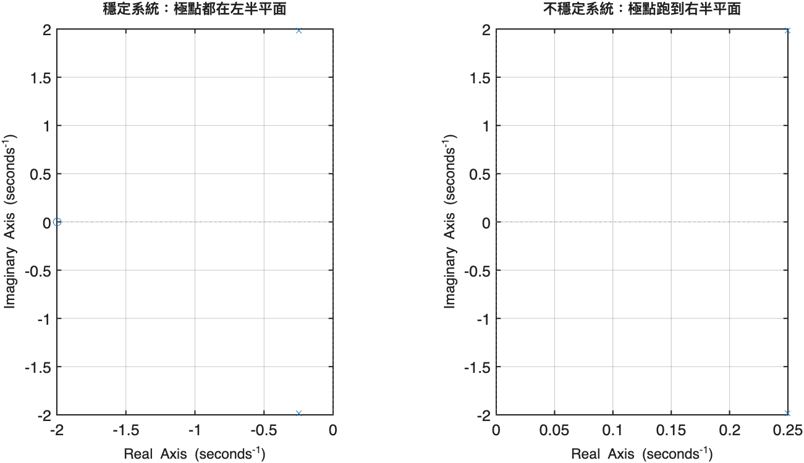

**核心定理**：閉迴路所有極點實部 < 0，系統就穩定。
所有的控制設計（PID 調參、根軌跡、LQR）本質上都在「把極點推到左半平面深處」。

---

## 2. 時域規格：用 `stepinfo` 自動算

工程上規格通常以時域給：

| 規格 | 物理意義 |
|------|---------|
| RiseTime | 從 10% 升到 90% 的時間 |
| SettlingTime | 進入 ±2% 範圍不再出來的時間 |
| Overshoot | 超過穩態值的最大百分比 |
| Peak | 峰值 |
| PeakTime | 達到峰值的時間 |

```matlab
G = tf(wn^2, [1, 2*zeta*wn, wn^2]);
info = stepinfo(G);   % 一次拿到全部
```

### 阻尼比對響應的影響

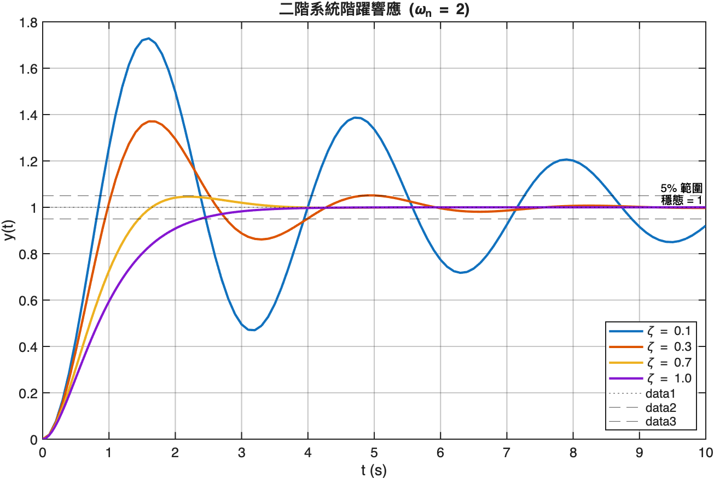

- ζ=0.1：明顯振盪、過衝大
- ζ=0.7：稍微過衝、收斂快（**設計常用值**）
- ζ=1.0：無過衝、最快無振盪

### 自然頻率 ω_n 控制速度

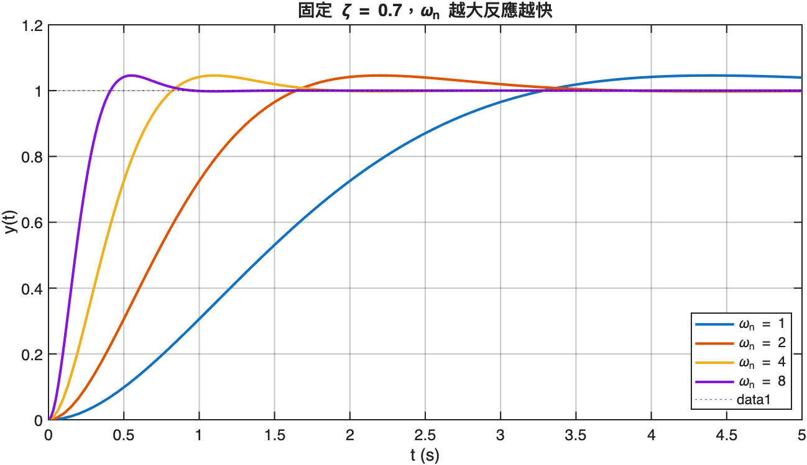

ω_n 越大，系統反應越快（settling time 與 1/ω_n 成正比）。但實際物理系統 ω_n 受致動器頻寬限制 — 不能無限放大。

### 規格視覺化

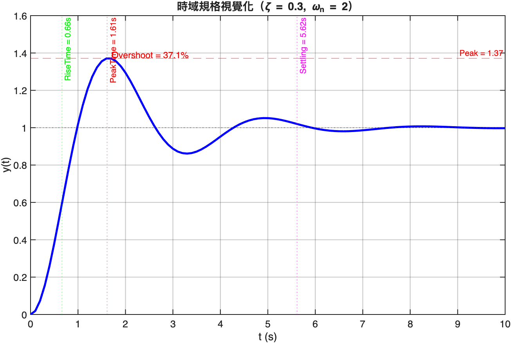

`stepinfo` 回傳的所有時域指標，這張圖一次標示出來。

---

## 3. 頻域：Bode、Nyquist、穩定餘裕

### Bode 圖

```matlab
G = tf(10, [1, 3, 2, 0]);   % 含積分器的三階 plant
bode(G);
```

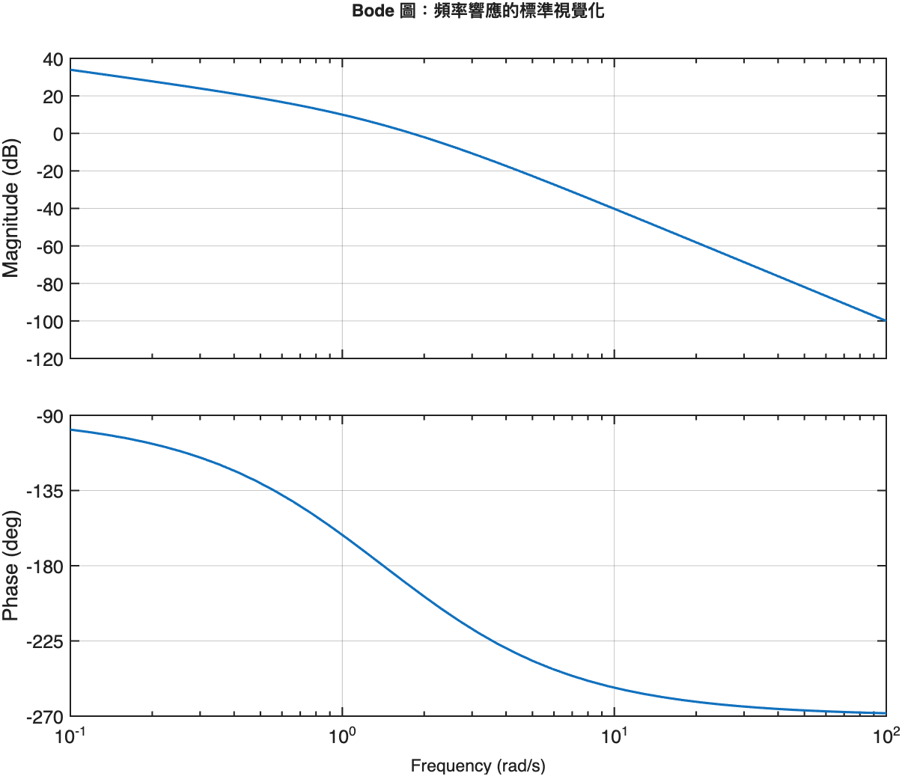

兩張子圖：上是 magnitude (dB)、下是 phase (deg)。橫軸 ω 取對數。

### 穩定餘裕

```matlab
margin(G);
[Gm, Pm, Wcg, Wcp] = margin(G);
```

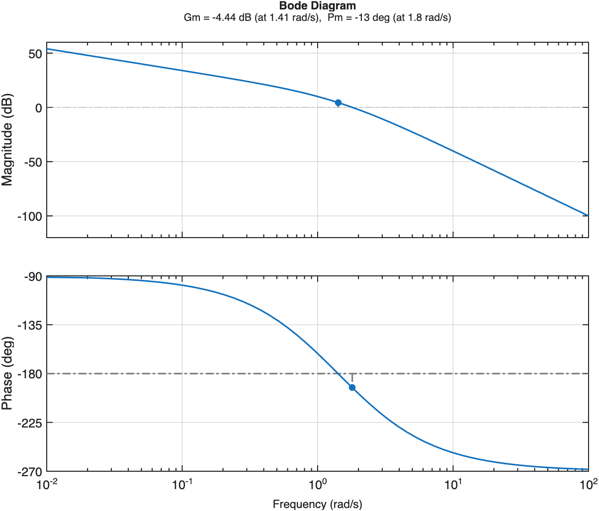

- **增益餘裕 (GM)**：相位 -180° 時還能允許增益放大多少倍
- **相位餘裕 (PM)**：增益穿越 0 dB 時還有多少相位空間

工程經驗：**GM > 6 dB、PM > 30°** 是安全閾值；**PM ≈ 60°** 對應 ζ ≈ 0.6 的良好設計。

### Nyquist 圖

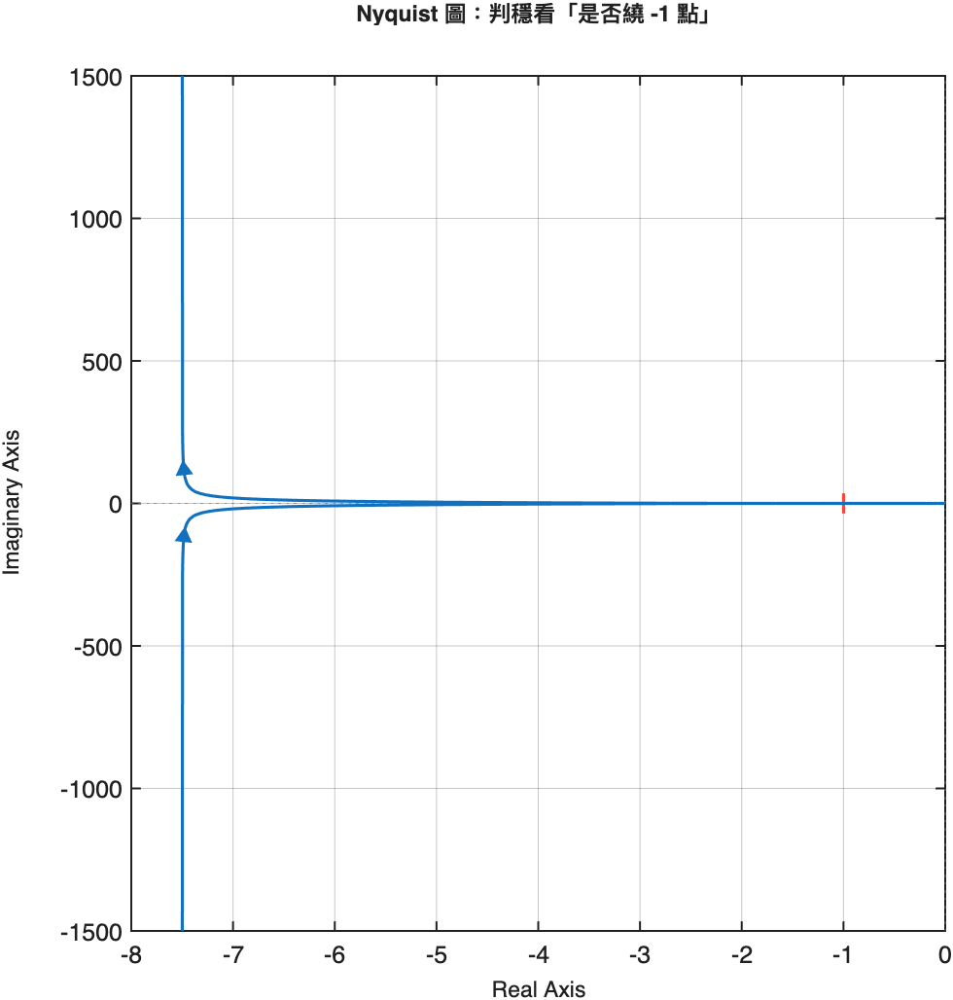

**Nyquist 判穩**：把 G(jω) 在複平面上畫一圈，看軌跡是否繞 `-1` 點。對開迴路穩定的系統，**不繞 -1 點 = 閉迴路穩定**。

### 不同 plant 的 Bode 形狀

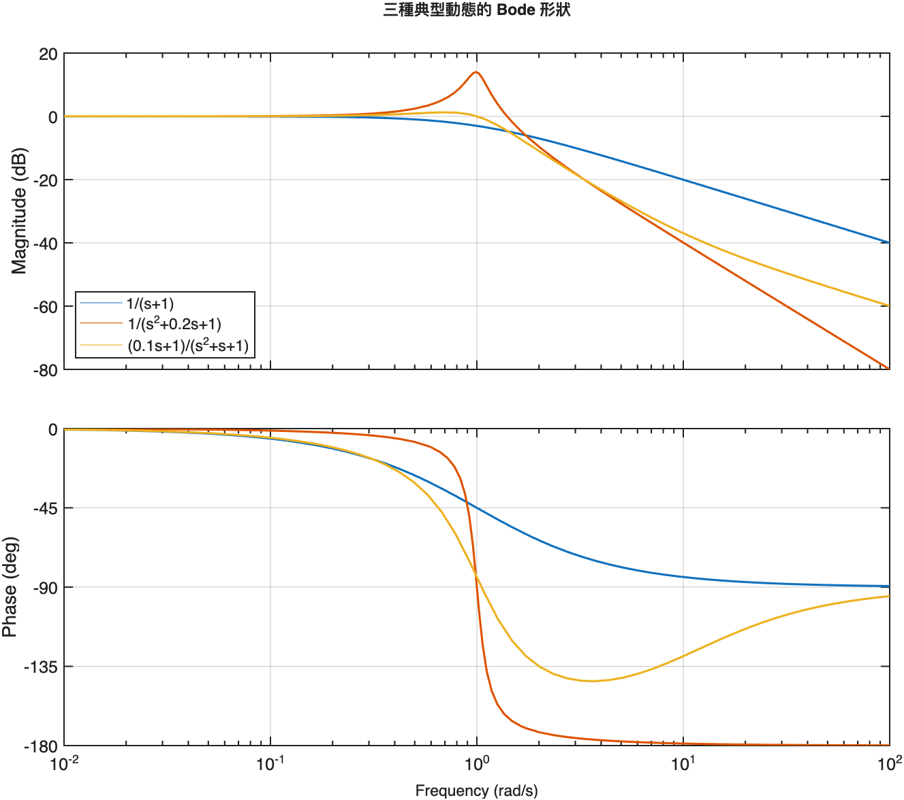

熟悉這些「形狀模板」之後看到 Bode 圖就能猜出系統特性。

---

## 4. 根軌跡

根軌跡顯示當回授增益 K 從 0 變化到 ∞，閉迴路極點怎麼移動。

```matlab
G = tf(1, conv([1, 1], conv([1, 2], [1, 5])));
rlocus(G);
sgrid(0.7, []);   % 畫 zeta=0.7 等阻尼線
```

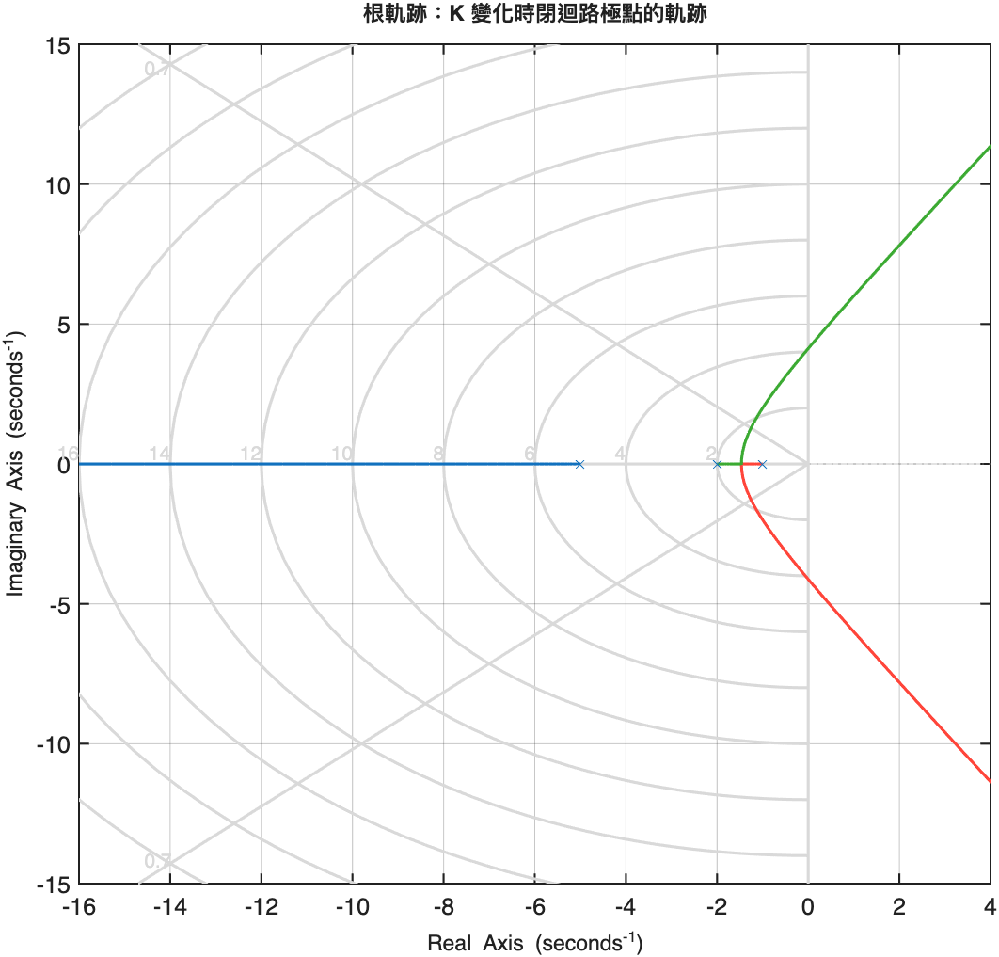

### 標出特定 K 值的極點位置

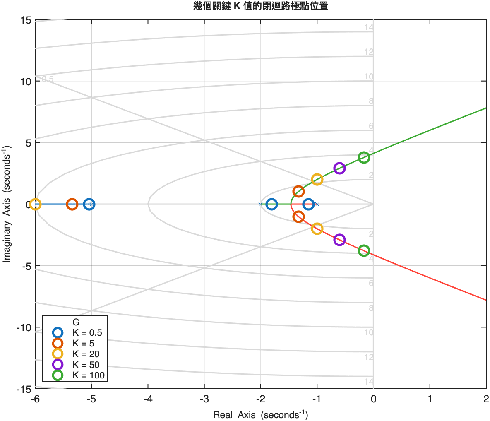

- K 小：極點靠近開迴路極點（系統慢）
- K 中：極點往右移、阻尼下降
- K 大：兩條軌跡跑到右半平面 -> 系統不穩定

### 對應的階躍響應

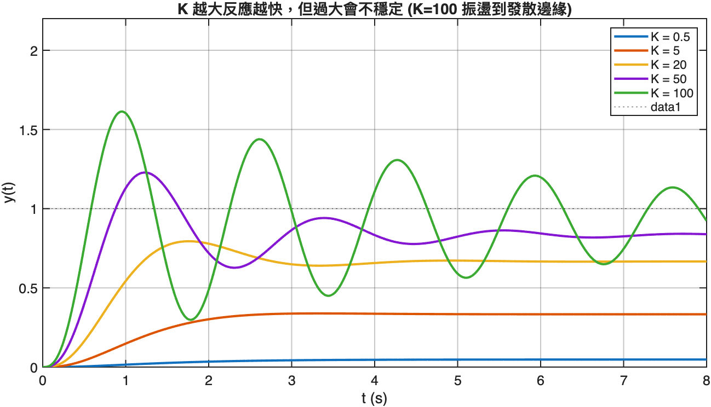

K=100 時已經接近持續振盪（極點在 jω 軸附近）。

### 臨界增益

掃描 K 找閉迴路最不穩定極點的實部：

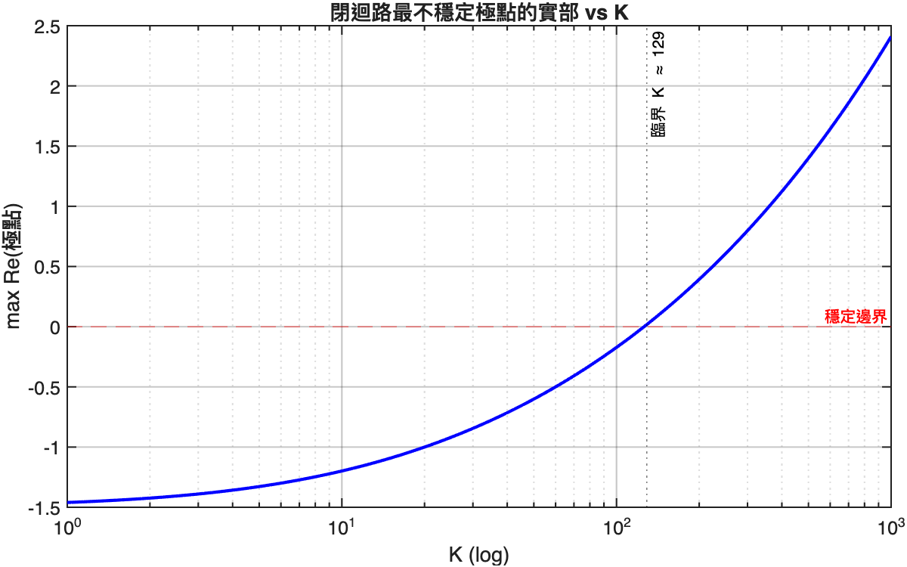

當實部過零的 K 值就是「臨界穩定增益」。對 G(s) = 1/[(s+1)(s+2)(s+5)] 大約是 K ≈ 129。

---

## 5. PID 控制：90% 工業界用的東西

```
u(t) = Kp*e(t) + Ki*∫e dt + Kd*de/dt
```

| 項 | 作用 |
|----|------|
| P | 比例 — 反應「現在誤差多大」 |
| I | 積分 — 消除穩態誤差 |
| D | 微分 — 抑制超衝、加速收斂 |

### P / PI / PID 比較

DC 馬達速度控制：

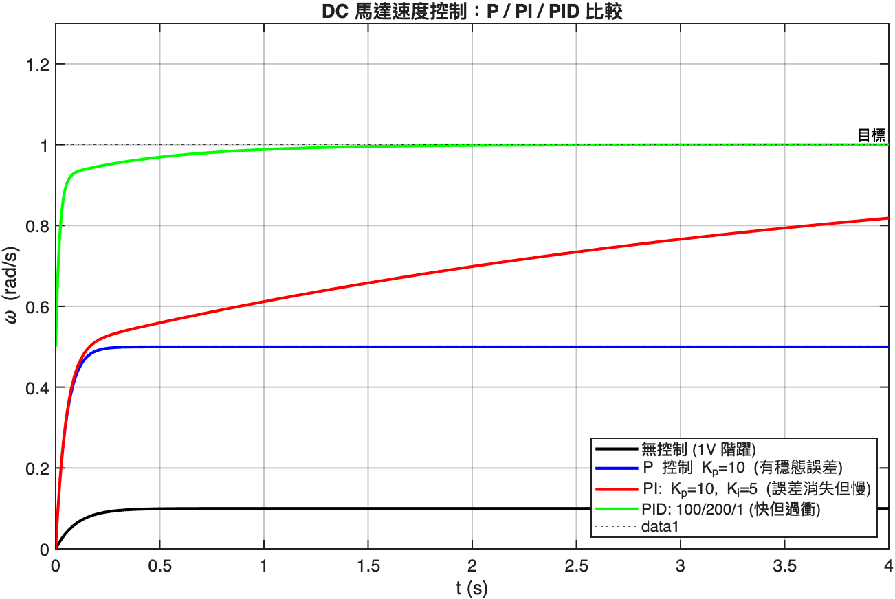

- 純 P：有穩態誤差（系統永遠到不了目標）
- PI：誤差消失但反應慢
- PID：快但 D 太大會放大雜訊（這裡示範手調未必最優）

### `pidtune` 自動調參

```matlab
[C, info] = pidtune(G, 'PID');
% C.Kp, C.Ki, C.Kd 自動算出來
% info.PhaseMargin 給設計穩定餘裕
```

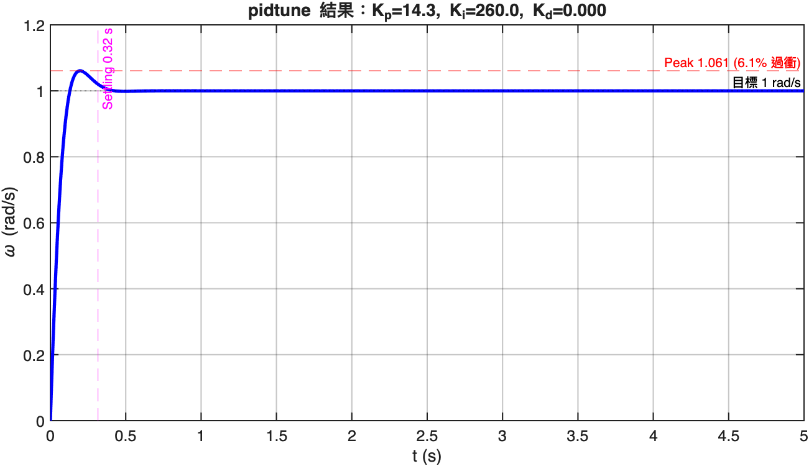

對 DC 馬達 plant，pidtune 給出 `Kp=14.33, Ki=260, Kd=0`（其實退化成 PI），settling ≈ 0.5s、PM ≈ 74°。

### 干擾抑制：閉迴路的真正價值

開迴路根本沒辦法應付負載突變。閉迴路 PID 自動修正：

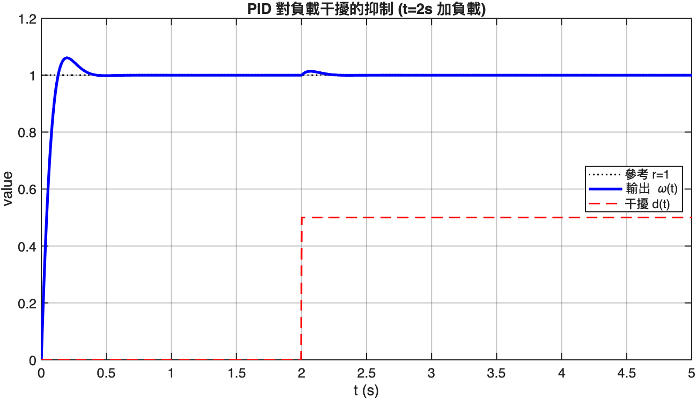

t=2s 時加 0.5N·m 負載擾動，PID 在約 0.5s 內把輸出拉回 1 rad/s。**這是回授控制存在的根本理由**。

### 手調 PID 的口訣

如果沒有 plant 模型，純試誤調：

1. **Kd, Ki 都先設 0**，慢慢調大 Kp 直到出現穩定振盪
2. **逐步加 Ki**，直到穩態誤差消失
3. **如有過衝**，加一點 Kd 抑制
4. 反覆微調

更系統的方法是 Ziegler-Nichols 經驗法則，但對複雜 plant 不如 `pidtune` 可靠。

---

## 6. 狀態空間：MIMO 的標準型式

```
x' = A·x + B·u
y  = C·x + D·u
```

任何 SISO 傳遞函數都可改寫成狀態空間（不唯一），但狀態空間天生支援 MIMO（多輸入多輸出）。

```matlab
A = [0, 1; -k/m, -c/m];   % 彈簧質量阻尼
B = [0; 1/m];
C = [1, 0];               % 量測位移
D = 0;
sys = ss(A, B, C, D);
tf(sys)                   % 想看傳遞函數可以隨時轉
```

### 從 ss 跑階躍

```matlab
sys = ss(A, B, C, D);
step(sys);          % 等價於 step(tf(sys))
```

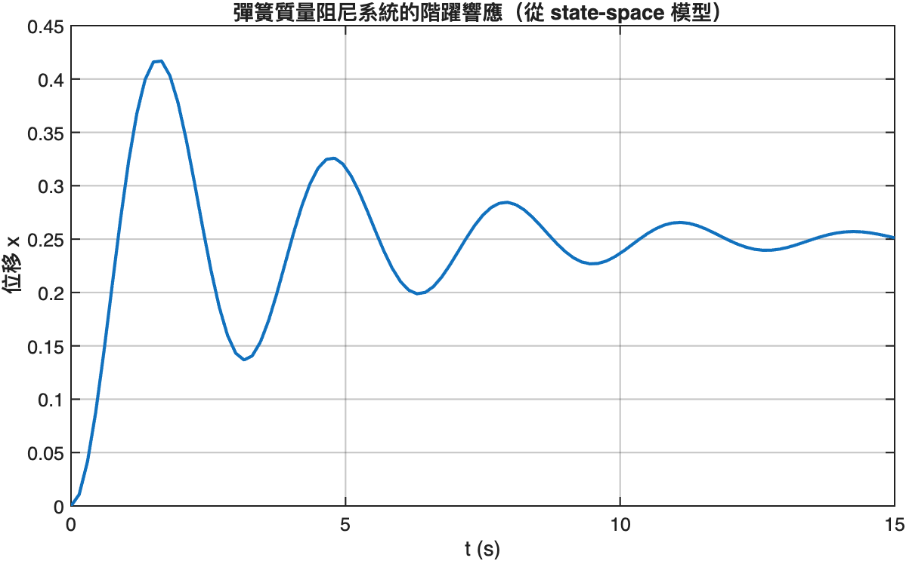

跟第 3 章用 `ode45` 解出的彈簧質量阻尼自由響應形狀一致 — 印證「狀態空間 ↔ ODE ↔ tf」三者等價。

### 可控性 & 可觀測性

```matlab
rank(ctrb(A, B)) == size(A, 1)   % 完全可控
rank(obsv(A, C)) == size(A, 1)   % 完全可觀測
```

**可控** = 任意給定初始狀態，能透過適當的 u 在有限時間內轉到任意目標。
**可觀測** = 從輸出 y 觀察一段時間後，能推回完整狀態。
LQR、卡爾曼濾波都假設這兩個性質。

### 極點配置 `place`

直接指定希望閉迴路極點放哪：

```matlab
desired = [-2 + 1i, -2 - 1i];
K = place(A, B, desired);
A_cl = A - B*K;
```

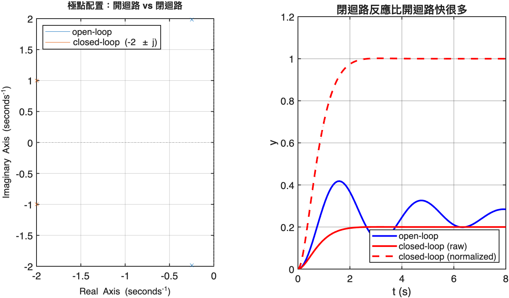

開迴路極點 -0.25 ± 1.98i（弱阻尼）被推到 -2 ± 1i（阻尼明顯增加），閉迴路反應快很多。

### MIMO 範例

兩個質量用彈簧連接的耦合系統：

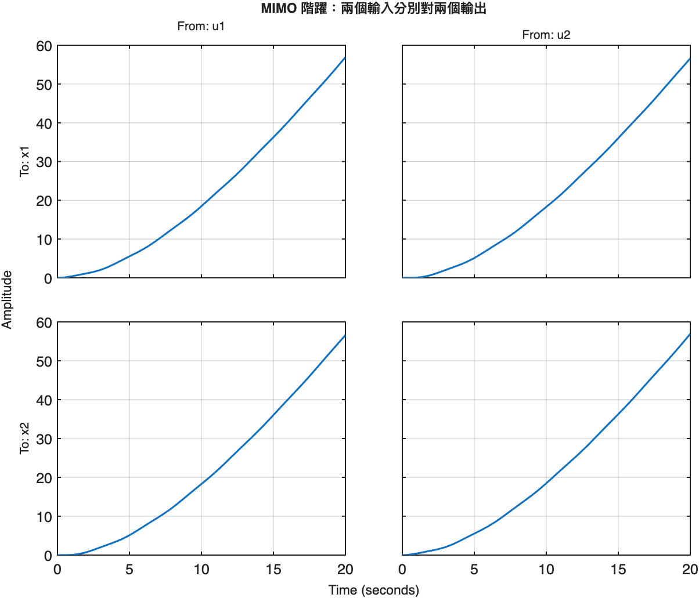

`step(sys_mimo)` 一次畫出「每個輸入對每個輸出」的響應矩陣。對角線是「自身致動」、非對角線是「耦合效應」。

---

## 7. LQR：最優狀態回授

PID 適合 SISO；對 MIMO 或多狀態問題，LQR 是首選。

**最優化問題**：

```
最小化 J = ∫₀^∞ (x'·Q·x + u'·R·u) dt
```

- Q 大：罰狀態偏離（要快收）
- R 大：罰控制能量（致動器有限制）

```matlab
K = lqr(A, B, Q, R);    % 一行得到最優增益
```

### 倒立擺：經典 LQR 試金石

倒立擺向上的平衡點是不穩定的（小擾動就倒）。線性化後 A 矩陣有正實部特徵值：

```
開迴路極點：
   0        <- 車位置自由
  -0.14     <- 車有摩擦
  -5.61     <- 擺收斂模態
   5.57     <- 擺發散模態（這就是不穩定）
```

設 `Q = diag(10, 1, 100, 1)`（強調擺角不能歪）、`R = 0.1`：

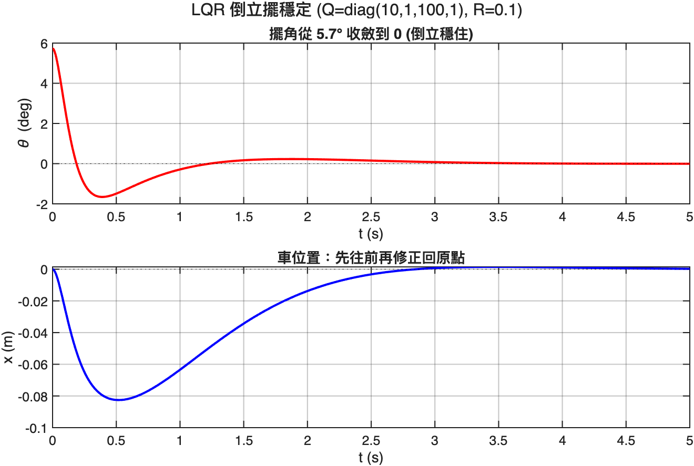

從擺角 5.7°、車位置 0 開始，LQR 在 ~3 秒內把擺收斂回 0、車回到原點。

### 控制力

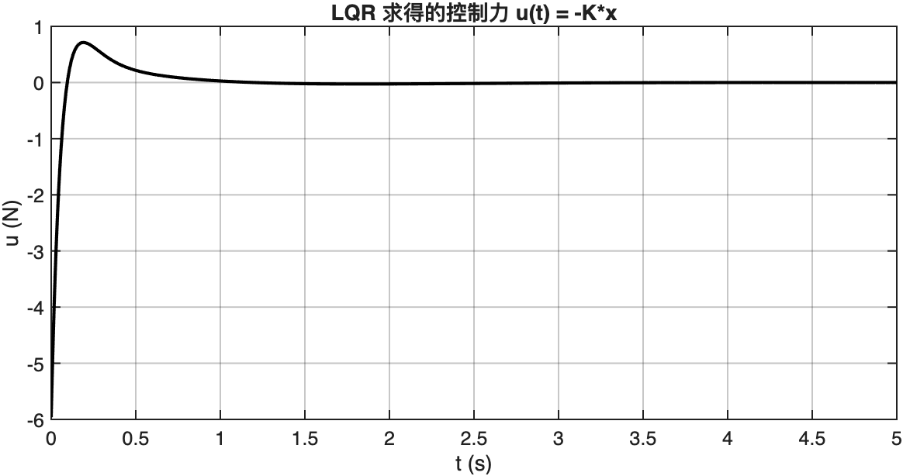

擾動越大、Q 越大，需要的控制力 |u| 就越大。

### Q 與 R 的權衡

固定 Q，掃 R：

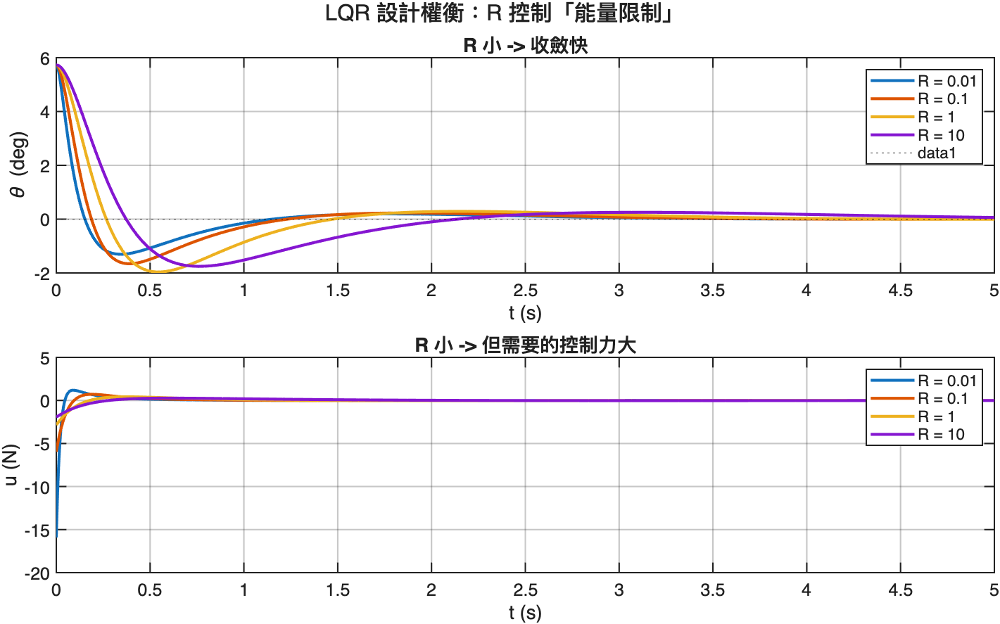

- R 小：可以用很大的控制力 -> 收斂快
- R 大：限制控制力 -> 收斂慢但實作可行

LQR 的設計直覺：**Q 是「結果優先級」、R 是「資源預算」**。

### LQR 的優勢與限制

優點：
- 一行算出全部增益 K
- 自動保證閉迴路穩定（A-BK 所有極點實部 < 0）
- 對 MIMO 自然延伸
- 有穩定餘裕保證（PM ≥ 60°, GM = ∞）

限制：
- 假設**完整狀態可量測** — 實際常需要狀態觀測器（Luenberger 或 Kalman）
- 是**線性化模型的最優**，大訊號 / 非線性效應不在考慮中
- Q、R 還是要憑工程感覺挑

---

## 下一章

[05. Simulink 入門](../05-simulink/README.md) — 用圖形化方塊圖把控制迴路接起來、做即時模擬。
