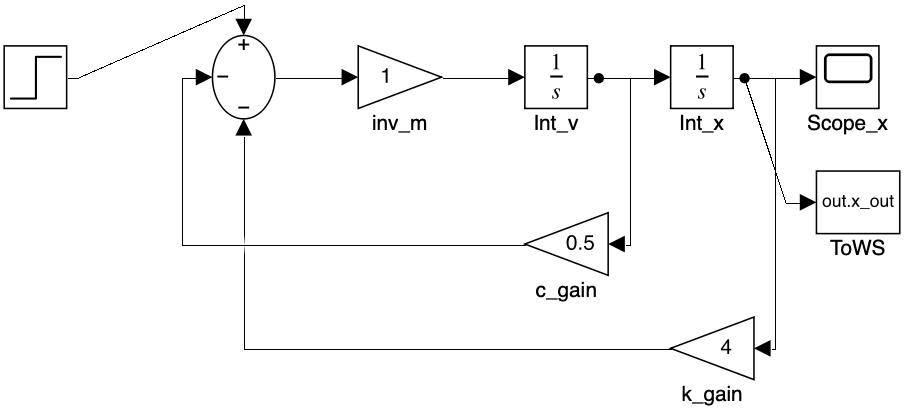
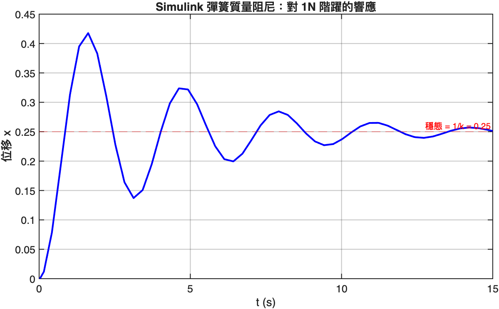
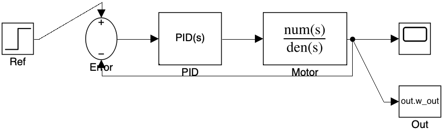
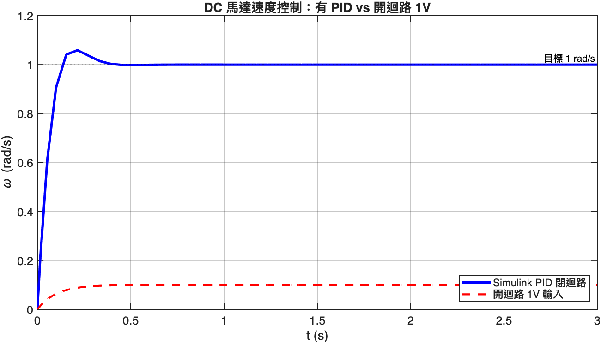

# 05. Simulink 入門

Simulink 是把控制系統用「方塊圖」拼出來的圖形化建模工具。對複雜系統（特別是有非線性、多模式、需要硬體在迴路 HIL 的場景），比純 MATLAB 程式碼直觀很多。

本章用「**程式化建模**」的方式建立兩個模型 — 這比手拉 GUI 對教學更可重現，且能完全用 `matlab -batch` 自動產出截圖。

| # | 腳本 | 主題 |
|---|------|------|
| 01 | [`01_build_spring_model.m`](scripts/01_build_spring_model.m) | 用 `add_block` 建立彈簧質量阻尼模型 |
| 02 | [`02_build_pid_motor.m`](scripts/02_build_pid_motor.m) | DC 馬達 + PID 控制器閉迴路 |

實際儲存的 `.slx` 檔案在 [`models/`](models/) — 可用 MATLAB 直接 `open smd_open.slx` 打開來玩。

---

## 1. 第一個 Simulink 模型：彈簧質量阻尼

### 為什麼用 Simulink 而不是 ODE？

對單純的線性系統，第 3 章的 `ode45` 就夠。Simulink 的優勢出現在：

- **多個子系統耦合**（例如：感測器動態 + 控制器 + 致動器 + plant）
- **包含非線性**（飽和、死區、量化）
- **多速率**（連續 plant + 離散 controller）
- **可生成 C 程式碼**到 ESP32、STM32、Arduino
- **硬體在迴路 (HIL) 測試**

### 程式化建模 vs GUI

兩種方式建出的模型完全一樣。GUI 適合 prototyping，程式化適合：

- 自動化測試（不同參數重建模型）
- 版本控制（`.slx` 是二進位，不容易 diff）
- 教學示範（可重現的 baseline）

### 建模流程

```matlab
modelName = 'smd_open';
new_system(modelName);
open_system(modelName);

% 1. 加方塊
add_block('simulink/Sources/Step', [modelName '/Step'], ...
    'Position', [50, 100, 80, 130], ...
    'Time', '0', 'After', '1');

% 2. 連線
add_line(modelName, 'Step/1', 'Sum/1');

% 3. 設定 solver
set_param(modelName, 'StopTime', '15', 'Solver', 'ode45');

% 4. 跑模擬
simOut = sim(modelName);
```

### 結果：彈簧質量阻尼方塊圖



對照數學：

```
m·x'' + c·x' + k·x = u
=>  x'' = (u - c·x' - k·x) / m
```

方塊圖讀法：
1. Sum 計算 `u - c·v - k·x`
2. 乘 `1/m` 得到 `x''`（加速度）
3. 第一個 Integrator 積分得到 `v = x'`（速度）
4. 第二個 Integrator 再積分得到 `x`（位置）
5. v 經 `c_gain` 回授到 Sum
6. x 經 `k_gain` 回授到 Sum

這就是「**用積分器搭出 ODE**」的標準寫法 — 高階導數從 Sum 出來，每經過一個 Integrator 階數降一階。

### 模擬結果



對 1N 階躍輸入，位移收斂到 1/k = 0.25 m（彈簧的胡克定律穩態）。與第 3 章的 ode45 結果完全一致。

---

## 2. DC 馬達 PID 閉迴路

### 模型結構



從左到右：
1. **Ref**：階躍 1 rad/s
2. **Error**：Sum 算 `e = ref - omega`
3. **PID**：用第 4 章 `pidtune` 得到的 Kp/Ki/Kd
4. **Motor**：DC 馬達傳遞函數 `Kt/R / (J·s + B + Kt·Kb/R)`
5. **回授**：Motor 輸出接回 Error 的負端

```matlab
add_block('simulink/Continuous/PID Controller', [modelName '/PID'], ...
    'Position', [200, 90, 260, 140], ...
    'P', '14.33', 'I', '260', 'D', '0');

add_block('simulink/Continuous/Transfer Fcn', [modelName '/Motor'], ...
    'Numerator', mat2str(num), ...
    'Denominator', mat2str([den_a, den_b]));
```

Simulink 內建的 **PID Controller** 方塊比手寫 PID 強：
- 自動處理「積分飽和」(anti-windup)
- 支援離散時間實作
- 可從 Simulink Tuner 互動調參

### 結果



對照組「開迴路直接餵 1V」最終穩態大概 0.09 rad/s — 因為 1V 在這個 plant 設定下根本不夠。
PID 閉迴路會自動把控制電壓加大到讓 omega 達到目標 1 rad/s，且收斂時間 < 0.5s。

---

## 程式化建模常用 API

| 函式 | 作用 |
|------|------|
| `new_system(name)` | 建立空模型 |
| `open_system(name)` | 開啟（可選） |
| `add_block(libpath, fullpath, ...)` | 加方塊 |
| `add_line(model, src, dst, 'autorouting', 'on')` | 連線 |
| `set_param(blockpath, 'Param', 'Value')` | 改方塊或模型參數 |
| `sim(name)` | 跑模擬，回傳 SimulationOutput |
| `save_system(name, path)` | 存成 .slx |
| `bdclose(name)` | 關閉 |
| `print('-s' + name, '-dpng', '-rDPI', file)` | 截 block diagram |

### 常用方塊路徑

| 用途 | libpath |
|------|---------|
| Step input | `simulink/Sources/Step` |
| Constant | `simulink/Sources/Constant` |
| Sine | `simulink/Sources/Sine Wave` |
| Sum | `simulink/Math Operations/Sum` |
| Gain | `simulink/Math Operations/Gain` |
| Integrator | `simulink/Continuous/Integrator` |
| Transfer Fcn | `simulink/Continuous/Transfer Fcn` |
| State-Space | `simulink/Continuous/State-Space` |
| PID Controller | `simulink/Continuous/PID Controller` |
| Saturation | `simulink/Discontinuities/Saturation` |
| Scope | `simulink/Sinks/Scope` |
| To Workspace | `simulink/Sinks/To Workspace` |

### Sum 方塊的端口字串

`'Inputs'` 參數用 `+`/`-` 表示每個端口的符號：

- `'++'`：兩個正端口
- `'+-'`：第一正第二負（最常見的誤差訊號）
- `'+--'`：一正兩負（彈簧質量阻尼裡的 `u - c·v - k·x`）

---

## 怎麼從 Simulink 拿結果回 MATLAB

兩種主流做法：

### 1. To Workspace 方塊

```matlab
add_block('simulink/Sinks/To Workspace', [modelName '/Out'], ...
    'VariableName', 'w_out', ...
    'SaveFormat', 'Structure With Time');

simOut = sim(modelName);
t = simOut.w_out.time;
y = simOut.w_out.signals.values;
```

### 2. Outport + sim 回傳

模型加 Outport (`simulink/Ports & Subsystems/Out1`)，然後：

```matlab
simOut = sim(modelName, 'SaveOutput', 'on');
y = simOut.yout{1}.Values;   % timeseries object
```

兩種都行，依個人偏好。教學用第一種比較直接。

---

## 進階：可以走的方向

本教程到這裡就把「基礎」帶完了。如果要深入，下面這幾個方向是工業界最常用的：

1. **Stateflow**：在 Simulink 裡嵌入有限狀態機（FSM）
   — 適合「正常 / 啟動 / 故障」這種模式切換邏輯

2. **Simscape**：第一性原理物理建模
   — 不用手寫 ODE，直接拉「彈簧」「阻尼」「電阻」「電容」這種物理元件方塊

3. **Simscape Multibody**：3D 多體機械系統
   — 機械手臂、四足機器人、車輛動力學

4. **Embedded Coder**：把 Simulink 模型自動生成 C/C++ 程式碼
   — 燒到 STM32、Speedgoat、dSPACE 等即時平台

5. **Reinforcement Learning Toolbox**：訓練 RL agent 取代 LQR/PID
   — 對非線性、高維度、模型未知的系統

6. **Linear Analysis Tool**：在 Simulink 模型任一點線性化、做 Bode/Nyquist
   — 非線性 plant 也能用線性工具設計局部控制器

---

## 結語

到這裡你應該對 MATLAB 在工程數學、物理模擬、自動控制上的角色有了完整的圖像：

- **MATLAB 是「向量化的計算機」** — 把數學公式變成可跑的程式
- **第 1~2 章建立的工具**（ODE、線代、頻域）是後面所有的基礎
- **第 3 章的物理模擬**示範了「寫下方程 → 改狀態向量 → ode45」這條 SOP
- **第 4 章的控制設計**串起時域、頻域、根軌跡、PID、LQR
- **第 5 章的 Simulink** 把這些工具用方塊圖視覺化，並通向實機部署

接下來最有效的學習方式是：**拿一個你關心的物理系統**（馬達、無人機、化學反應器、暖氣機⋯），照本教程的 SOP 走一遍。讀十遍書不如自己做一個 prototype。
